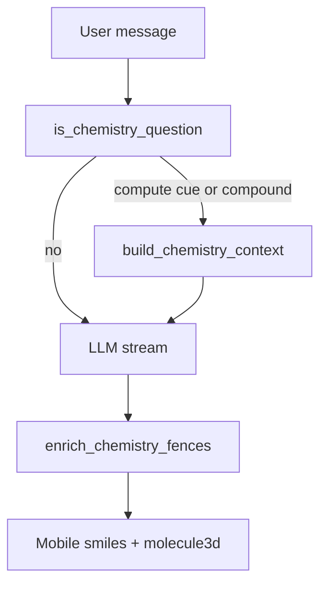

# Recall chemistry pipeline

Server-side RDKit, SymPy, and PubChem verify numbers and structures; the mobile app
only renders. Do not add on-device solving.

## Default product path

1. **Gate** (`is_chemistry_question`) — compute cues (balance, molar mass, stoich
   *with an equation*, descriptors, pH, molarity/dilution, gas-law phrases, element
   lookup) **or** compound-name lookup. Tight conjunctions: “how many” alone does not
   fire; `pressure` + `volume` is not a gas-law cue (that stole PubChem).
2. **Pre-stream** (`build_chemistry_context`) — conservative extractors call existing
   solvers. A `[Verified …]` block is injected only when `error is None`. Missing
   numbers omit the branch (LLM prose). Never invent a value.
3. **LLM stream** — model explains in Markdown. Structures use ` ```smiles `
   (alias ` ```chemistry `). The hint forbids emitting ` ```molecule3d ` or talking
   about attaching fences.
4. **Post-stream** (`enrich_chemistry_fences`) — `map_closed_fences` (bare-backtick
   closers only). Invalid SMILES become an italic note. Every closed fence is
   validated first; ` ```molecule3d ` is attached for the first two valid molecules
   so one slow `EmbedMolecule` cannot skip stripping later invalid fences.
5. **Mobile** — `parseChemistryFence` / smiles-drawer 2D; optional 3D from the
   server SDF. Adjacent smiles + molecule3d collapse to one card.



## Formula vs SMILES (`molar_mass`)

Hill formulas (`CO`, `C`, `H2O`, hydrates like `CuSO4.5H2O`) are summed from
`PERIODIC_TABLE` so RDKit cannot saturate them into hydrides (methanol / methane).

Prefer RDKit when the string looks like **organic SMILES**: SMILES-only chars
`= # [ ] @`, or 3+ letters, no digits, and a Hill parse of only 1-letter elements
(`CCO` is ethanol, not C₂O). `NaCl` stays a formula.

## Verified today

| Kind | How |
|------|-----|
| Equation balancing | SymPy nullspace; require a unique solution, every coeff ≥ 1, re-sum atoms. Else `balanced=False` (`underdetermined` / `non-positive coefficient` / `atoms do not balance`). |
| Molar mass | Hill table or RDKit SMILES (rule above). Hydrates split on `.` / `·`. |
| Stoichiometry | Balanced equation + `N mol FORMULA` → `stoichiometry`. No amount → mole-ratio hint from the balanced equation only. |
| Limiting reagent | `limiting reagent` + two or more amounts. |
| Ideal gas | `PV=nRT` / Boyle / Charles / Gay-Lussac / `gas law` **and** exactly one of P/V/n/T missing. |
| Molarity / dilution | mol + L, or M1 V1 and one of M2/V2. |
| pH | `[H+] =`, `pOH =`, or `pH =` asking `[H+]`. |
| Element lookup | Atomic mass / element name → `PERIODIC_TABLE` (He/Ne/Ar have no electronegativity). |
| Descriptors | LogP / TPSA / Lipinski when a SMILES is in the message. |
| Compound lookup | PubChem PUG-REST by name (URL-quoted; Redis TTL ~24h, key `pubchem:name:{normalized}`). Failures are not cached. |

Label `[Verified …]` only on solver success. Do **not** reintroduce `[Gas law hint]` /
`[Solution chemistry hint]` blocks that pretend to verify.

## Unreachable (implemented, not on this path)

These exist on `chemistry_service` and stay unused on purpose:

- `generate_2d_coordinates` — mobile smiles-drawer owns 2D
- `lookup_by_smiles` / `fetch_3d_sdf` — 3D is local RDKit on the closed SMILES fence

## Not implemented (LLM prose only)

Same bargain as Golden Rule 7 for math: verified kinds only. The model may talk
about the rest; it must **not** claim a verified result.

Buffers, Ka/Kb, ICE tables, titration curves, thermochemistry (ΔH/ΔG/ΔS, Hess),
kinetics, electrochemistry (Nernst, cells), organic mechanism/IUPAC naming,
spectroscopy, crystal-field / MO theory, nuclear, and biochemistry pathways.

A `ChemIntent` extractor registry (math-style `kind` + extractors) is **deferred**.
New verified work still lands as a conservative extractor in `build_chemistry_context`
plus pytest — do not add a second kind table in this round.

## Key files

| Layer | Path |
|-------|------|
| Gate + inject | `apps/api/app/services/chemistry/context.py` |
| Balance + hydrates | `apps/api/app/services/chemistry/equations.py` |
| Mass / stoich / table | `apps/api/app/services/chemistry/stoichiometry.py` |
| pH / gas / solutions | `apps/api/app/services/chemistry/solutions.py` |
| SMILES / 3D | `apps/api/app/services/chemistry/smiles.py` |
| Post-stream fences | `apps/api/app/services/chemistry/fence.py` |
| PubChem | `apps/api/app/gateways/pubchem_gateway.py` |
| Prompt hint | `apps/api/app/services/chat/prompt_constants/visuals.py` |
| Mobile parse / render | `apps/mobile/lib/chemistryFence.ts`, `components/rich/` |

Compatibility aliases (`chemistry_service.py`, `chemistry_context.py`,
`chemistry_fence.py`) stay; tests lock them.

Flag: `chemistry_enabled` (default on).
