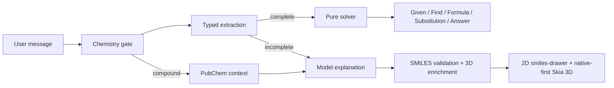

# Recall chemistry pipeline

Server-side typed extractors, pure solvers, RDKit, SymPy, and PubChem verify
chemistry. The mobile app renders the result; it does not solve chemistry on-device.

## Default product path

1. **Gate** (`request.py`) — recognizes supported calculations, chemistry-specific
   language, element questions, descriptors, and compound lookup. Generic phrases such
   as “how many” do not fire the chemistry path on their own.
2. **Extract** (`extract.py`) — converts a complete, unambiguous text problem to a
   validated `ChemistryIntent`. Missing or conflicting values return `None`; the
   extractor never invents a value.
3. **Solve** (`solvers/`) — grouped deterministic solvers return `ChemistryResult` with
   Given, Find, named universal Formula, Substitution, and Answer fields.
4. **Respond** (`direct.py`) — a complete typed calculation returns the exact compact
   five-section answer without waiting for model prose. Image questions remain on the
   vision/model path because OCR text was not the typed extractor input.
5. **Enrich** (`fence.py`) — closed `smiles` / `chemistry` fences are validated. The
   server appends `molecule3d` SDF for the first two valid structures.
6. **Render** — smiles-drawer retains chemically aware 2D layout inside its sandboxed
   WebView. The interactive 3D molecule projection uses a native Skia canvas, with the
   same projected SVG scene as a safe Expo Go / stale-client fallback. Adjacent 2D and
   3D fences collapse into one molecule card.

## Formula vs SMILES (`molar_mass`)

Hill formulas (`CO`, `C`, `H2O`, hydrates such as `CuSO4.5H2O`) are summed from
`PERIODIC_TABLE`, so RDKit cannot saturate them into hydrides. Organic strings that
use SMILES-only syntax, or strings such as `CCO`, use RDKit. `NaCl` stays a formula.

## Verified calculation coverage

| Group | Operations |
|---|---|
| Equations | balancing with atom re-checking |
| Amounts | molar mass, mass ↔ moles, moles ↔ particles, percent composition, percent yield |
| Stoichiometry | mole ratios and limiting reagent |
| Solutions | molarity, dilution, molality, mass percent |
| Acid–base | pH from `[H+]` or pOH, `[H+]` from pH, pOH from `[OH-]`, Henderson–Hasselbalch buffers |
| Gases | ideal-gas law with any one of P, V, n, or T unknown |
| Thermochemistry | `q = mcΔT`, `ΔG = ΔH − TΔS` |
| Equilibrium | `Kc` and `Qc` for simple balanceable concentration expressions |
| Kinetics | first-order half-life/concentration and Arrhenius rate constant |
| Electrochemistry | `ΔG° = −nFE°`, Nernst potential, Faraday electrolysis mass |
| Nuclear | half-life decay |
| Spectroscopy | Beer–Lambert absorbance or concentration |

Element lookup, molecular descriptors, and PubChem compound lookup are also verified
context sources. A result is labelled verified only after extraction and solver success.

## Deliberate model-only boundary

The model may explain work outside the table, but must not call it verified. This
includes Ka/Kb or ICE-table algebra beyond the buffer equation, titration curves,
multi-reaction Hess problems, non-first-order or mechanism kinetics, organic reaction
mechanisms and IUPAC naming, spectroscopy beyond Beer–Lambert, crystal-field/MO
theory, balancing nuclear equations, and biochemistry pathways.

## Key files

| Layer | Path |
|---|---|
| Intent schema | `apps/api/app/models/schemas/chemistry/intent.py` |
| Gate / compound parsing | `apps/api/app/services/chemistry/request.py` |
| Text extraction | `apps/api/app/services/chemistry/extract.py` |
| Typed solver dispatcher | `apps/api/app/services/chemistry/solvers/solver.py` |
| Grouped solvers | `apps/api/app/services/chemistry/solvers/amounts.py`, `solutions.py`, `physical.py` |
| Verified block / direct reply | `apps/api/app/services/chemistry/block.py`, `direct.py` |
| Turn integration | `apps/api/app/services/chemistry/context.py` |
| Balance / formula primitives | `apps/api/app/services/chemistry/equations.py`, `stoichiometry.py` |
| SMILES / 3D / post-stream | `apps/api/app/services/chemistry/smiles.py`, `fence.py` |
| PubChem | `apps/api/app/gateways/pubchem_gateway.py` |
| Mobile parse / render | `apps/mobile/lib/chemistry/`, `apps/mobile/components/rich/` |

Feature flag: `chemistry_enabled` (on by default).
