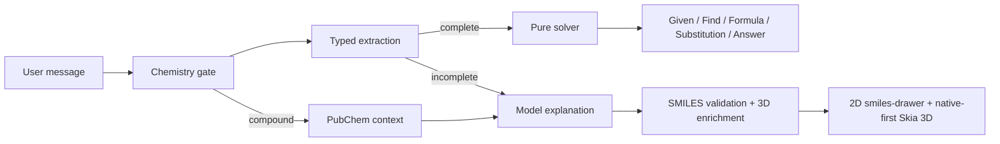

# Recall chemistry pipeline

Server-side typed extractors, pure solvers, RDKit, SymPy, and PubChem verify
chemistry. The mobile app renders the result; it does not solve chemistry on-device.

## Default product path

1. **Gate** (`request.py`) — recognizes supported calculations, chemistry-specific
   language, element questions, descriptors, and compound lookup. Generic phrases such
   as “how many” do not fire the chemistry path on their own.
2. **Extract** (`extract.py`) — converts a complete, unambiguous text problem to a
   validated `ChemistryIntent`. Missing or conflicting values return `None`; the
   extractor never invents a value.
3. **Solve** (`solvers/`) — grouped deterministic solvers return `ChemistryResult` with
   Given, Find, named universal Formula, Substitution, and Answer fields.
4. **Respond** (`direct.py`) — a complete typed calculation returns the exact compact
   five-section answer without waiting for model prose. The value is a server
   ` ```answer ` fence whose first line is `notation: chemistry`, so the client
   draws it as text instead of LaTeX. Image questions remain on the vision/model
   path because OCR text was not the typed extractor input.
5. **Finalize** (`fence.py`) — a verified result drops model answer, scene, and
   structure fences and appends the solver's copies. Closed `smiles` / `chemistry`
   fences are then validated. The server appends `molecule3d` SDF for the first
   two valid structures.
6. **Render** — smiles-drawer retains chemically aware 2D layout inside its sandboxed
   WebView. The interactive 3D molecule projection uses a native Skia canvas, with the
   same projected SVG scene as a safe Expo Go / stale-client fallback. Adjacent 2D and
   3D fences collapse into one molecule card.


```mermaid
flowchart LR
  message[User message] --> gate[Chemistry gate]
  gate --> extract[Typed extraction]
  extract -->|complete| solve[Pure solver]
  solve --> direct[Given / Find / Formula / Substitution / Answer]
  extract -->|incomplete| model[Model explanation]
  gate -->|compound| pubchem[PubChem context]
  model --> enrich[SMILES validation + 3D enrichment]
  pubchem --> model
  enrich --> mobile[2D smiles-drawer + native-first Skia 3D]
```

## Formula vs SMILES (`molar_mass`)

Hill formulas (`CO`, `C`, `H2O`, hydrates such as `CuSO4.5H2O`) are summed from
`PERIODIC_TABLE`, so RDKit cannot saturate them into hydrides. Organic strings that
use SMILES-only syntax, or strings such as `CCO`, use RDKit. `NaCl` stays a formula.

## Shared chemistry primitives

Verified operations share one species model instead of one-off formula patches.

| Primitive | What it carries |
|---|---|
| Element | all 118 elements: atomic number, symbol, name, atomic mass, and, where a standard value exists, group, period, electronegativity, common oxidation states, and electron configuration. Superheavy masses are the mass number of a long-lived isotope and are marked as such. Helium, neon, and argon omit electronegativity. |
| `ChemicalSpecies` | formula, elemental composition, ionic charge, and optional phase (`s`, `l`, `g`, `aq`) |
| `ChemicalReaction` | reactant and product terms, each a species plus a coefficient |
| Quantity | school units normalized through the shared Pint registry (`25 °C` → 298.15 K, mmHg/kPa/bar → atm, mL → L) before a solver sees them |

Balancing builds a SymPy nullspace over atoms and, when any species is charged, over charge. It recounts both and refuses an underdetermined or non-positive coefficient set. Electrons are a species with charge −1 and no atoms. A glued `+` or `−` is charge (`Fe2+`, `MnO4-`, `SO4^2-`); `H2 + O2` stays a term separator.

Pure solids and liquids are omitted from `Kc`, `Kp`, and solubility products only when the phase is written on the species. An unlabeled formula still counts, so a homogeneous concentration equilibrium is unchanged.

## Verified calculation coverage

| Group | Operations |
|---|---|
| Equations | atom-and-charge balancing, including ionic and redox half-equations that contain `e-` |
| Amounts | molar mass, mass ↔ moles, moles ↔ particles, percent composition, percent yield, empirical formula, molecular formula |
| Stoichiometry | mole ratios; grams, moles, or particles through the balanced ratio to grams, moles, or particles; solution volume/molarity → product; gas volume at the same P and T; limiting reagent from masses or solution volumes, with theoretical yield and excess reactant |
| Solutions | molarity, dilution, molality, mass percent, boiling-point elevation, freezing-point depression, osmotic pressure, Raoult's law |
| Acid–base | pH from `[H+]`, pOH, or a strong monoprotic acid / strong base concentration; weak-acid and weak-base quadratics; `Ka`/`Kb`/`Kw` and `pKa`/`pKb`; Henderson–Hasselbalch; buffer after adding strong acid or base; strong titration, weak acid–strong base, and weak base–strong acid regions; first dissociation of a polyprotic acid |
| Gases | ideal gas for any one of P, V, n, or T; combined gas law; Boyle; Charles; Dalton; mole-fraction partial pressure; gas collected over water |
| Thermochemistry | `q = mcΔT`, calorimetry `q_rxn = −q_cal`, Hess's law, formation enthalpy, bond enthalpy, `ΔG = ΔH − TΔS` |
| Equilibrium | homogeneous `Kc` and `Qc`; phase-aware `Kc`/`Kp`; `Kc` ↔ `Kp`; quadratic ICE solutions; `Ksp`, molar solubility, common-ion solubility, and `Qsp` versus `Ksp` |
| Kinetics | zero-, first-, and second-order integrated laws and half-lives; integer order from two experiments; one-temperature and two-temperature Arrhenius |
| Electrochemistry | `ΔG° = −nFE°`, Nernst potential, Faraday electrolysis mass, `E°cell = E°cathode − E°anode`, and a galvanic cell from the built-in reduction table |
| Nuclear | half-life amount, decay constant, exponential decay, activity `A = λN`, one-missing-product nuclear equations (alpha, beta, positron, electron capture), and mass defect / binding energy when the nuclear mass in u is supplied |
| Spectroscopy | Beer–Lambert for any one of absorbance, molar absorptivity, path length, or concentration; IR and 1H NMR ranges for recognized functional groups; a peak lists every group whose range contains it; the n+1 rule when the neighbor count is stated; molecular ion is the monoisotopic mass with nominal m/z and the Cl/Br M+2 pattern |
| Structure | school oxidation states, formal charge, and single-center VSEPR. The molecular angle is separate from the ideal electron-domain angle (water 104.5°, ammonia 107°). A single carbon is the center of an HCN-style formula. Identical terminals with unequal bonds are counted as resonance forms |
| Organic | RDKit functional groups, CIP stereochemistry, and isomer class (identical, constitutional, or stereo). A PubChem `IUPACName` is verified only when that property is returned. Five one-product reactions (HBr addition, bromine addition, acid hydration, primary-halide hydroxide substitution, esterification) return one SMILES |
| Inorganic | oxidation state, coordination number, and additive name for the built-in ligand table. Crystal field for a first-row metal: coordination number 6 is octahedral and 4 is tetrahedral; CN− and CO make octahedral d4–d7 low-spin; every other case is high-spin; the answer includes unpaired electrons and `μ = √(n(n+2))` |
| Analytical | linear calibration, gravimetric factor, one-point standard addition, sample standard deviation, standard error, percent error, relative uncertainty of a product or quotient, and chromatography `Rf` |
| Biochemistry | Michaelis–Menten for any one of `v`, `Vmax`, `Km`, and `[S]` |

Element lookup (including atomic number and configuration), molecular descriptors, and PubChem compound lookup are also verified context sources. A result is labelled verified only after extraction and solver success.

The galvanic table is the common school set Na, Mg, Al, Zn, Fe, Ni, Pb, H, Cu, and Ag. Polyprotic pH uses the first dissociation only. Rate-law fitting needs the two experiments to change one concentration. VSEPR refuses a chain or a second central atom (`H2O2`, acetic acid), a formula whose center is not determined (`HOCl`), transition metals, and a Lewis structure whose formal charges do not sum to the charge. Lone-pair angles other than water and ammonia are reported as less than the ideal angle, not as one invented measurement. Sulfuric acid is refused as a strong monoprotic acid. Oxidation states that the school rules do not decide, such as `FeS`, are refused.

## Teaching scenes

A complete balance, stoichiometry chain, VSEPR, titration, ICE, or galvanic-cell
answer appends one server-owned `chem_scene` fence. The phone only draws that
JSON. The model prompt does not describe the fence.

## Deliberate model-only boundary

The model may explain work outside the table, but must not call it verified. This
includes curved-arrow reaction mechanisms, biochemical pathways, chromatogram
images, a structure guessed from one spectral peak, and a nuclear mass that was
not supplied. Coordination number 4 is drawn as tetrahedral, not square planar.

## Key files

| Layer | Path |
|---|---|
| Intent schema | `apps/api/app/models/schemas/chemistry/intent.py` |
| Gate / compound parsing | `apps/api/app/modules/chemistry/request.py` |
| Text extraction | `apps/api/app/modules/chemistry/extract.py`, `extractors/` |
| Typed solver dispatcher | `apps/api/app/modules/chemistry/solvers/solver.py` |
| Formula catalog | `apps/api/app/modules/chemistry/catalog.py` |
| Teaching scenes | `apps/api/app/modules/chemistry/scene.py` |
| Grouped solvers | `apps/api/app/modules/chemistry/solvers/` |
| Verified block / direct reply | `apps/api/app/modules/chemistry/block.py`, `direct.py` |
| Turn integration | `apps/api/app/modules/chemistry/context.py` |
| Balance / formula primitives | `apps/api/app/modules/chemistry/equations.py`, `stoichiometry.py` |
| Species, elements, units | `species.py`, `elements.py`, `quantity.py` |
| Structure / organic / nuclear | `structure.py`, `lewis.py`, `organic.py`, `coordination.py`, `nuclear.py` |
| SMILES / 3D / post-stream | `apps/api/app/modules/chemistry/smiles.py`, `fence.py` |
| PubChem | `apps/api/app/gateways/pubchem_gateway.py` |
| Mobile parse / render | `apps/mobile/lib/chemistry/`, `apps/mobile/components/rich/` |

Feature flag: `chemistry_enabled` (on by default).
