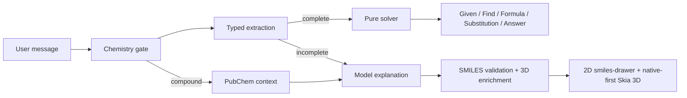

# Recall chemistry pipeline

Server-side typed extractors, pure solvers, RDKit, SymPy, and PubChem verify
chemistry. The mobile app renders the result; it does not solve chemistry on-device.

## Default product path

1. **Gate** (`request.py`) — recognizes supported calculations, chemistry-specific
   language, element questions, descriptors, and compound lookup. Generic phrases such
   as “how many” do not fire the chemistry path on their own, and neither do words that
   are chemistry only in company (`acid`, `base`, `boiling`, `nuclear`, `mole`,
   `compound`, `bond`): those need a second cue or a chemical formula. Symbols such as
   `Ka`, `pH`, and `Rf` match only with that capitalization (not “KB” or “Ph.D.”), and
   a scientist's name needs “law” (Charles's law, not Charles Darwin). “Chemistry” is
   the subject except in the idiom for getting along (“great chemistry”, “the chemistry
   between them”), and a half-life needs a number, a nuclide or a decay word (not a phone
   battery's). The gate reads
   the first and last 2,000 characters and its formula pattern is linear-time, so a
   long paste cannot stall the event loop. PubChem lookups on the turn path give up
   after 2 seconds.
2. **Extract** (`extract.py`) — converts a complete, unambiguous text problem to a
   validated `ChemistryIntent`. Missing or conflicting values return `None`; the
   extractor never invents a value. A number that carries a unit is converted, and a
   unit the registry cannot convert declines the problem instead of being read as the
   default unit. `1.8 × 10^-5` is read whole, never as `1.8`, by the shared
   `services/number_text` reader. One line is extracted once per turn: the result is
   cached per text and each caller gets its own copy. Extraction is
   template-driven: it recognises a fixed set of phrasings, and a problem outside them
   goes to the model, unverified.
3. **Solve** (`solvers/`) — grouped deterministic solvers return `ChemistryResult` with
   Given, Find, named universal Formula, Substitution, and Answer fields.
4. **Respond** (`direct.py`) — a complete typed calculation returns the exact compact
   five-section answer without waiting for model prose. The value is a server
   ` ```answer ` fence whose first line is `notation: chemistry`, so the client
   draws it as text instead of LaTeX. Image questions remain on the vision/model
   path because OCR text was not the typed extractor input. Substitution is the
   formula with the numbers put in, never a repeat of the answer.
5. **Finalize** (`fence.py`) — a verified result drops model answer, scene, and
   structure fences and appends the solver's copies. An unclosed model fence is closed
   first, so it cannot swallow the fences the server appends. Closed `smiles` /
   `chemistry` fences are then validated. The server appends `molecule3d` SDF for the
   first two valid structures, at most 120 heavy atoms each, so the client never has to
   drop an oversize block.
6. **Render** — smiles-drawer retains chemically aware 2D layout inside its sandboxed
   WebView. The interactive 3D molecule projection uses a native Skia canvas, with the
   same projected SVG scene as a safe Expo Go / stale-client fallback. Adjacent 2D and
   3D fences collapse into one molecule card.


```mermaid
flowchart LR
  message[User message] --> gate[Chemistry gate]
  gate --> extract[Typed extraction]
  extract -->|complete| solve[Pure solver]
  solve --> direct[Given / Find / Formula / Substitution / Answer]
  extract -->|incomplete| model[Model explanation]
  gate -->|compound| pubchem[PubChem context]
  model --> enrich[SMILES validation + 3D enrichment]
  pubchem --> model
  enrich --> mobile[2D smiles-drawer + native-first Skia 3D]
```

## Formula vs SMILES (`molar_mass`)

Hill formulas (`CO`, `C`, `H2O`, hydrates such as `CuSO4.5H2O`) are summed from
the element table (`elements.py`), so RDKit cannot saturate them into hydrides. Organic
strings that use SMILES-only syntax (`=`, `#`, `@`, ring-closure digits such as
`C1CCCCC1`), or strings such as `CCO`, use RDKit. `NaCl` stays a formula. Molar mass is shown to two decimals (glucose 180.16 g/mol).

## Shared chemistry primitives

Verified operations share one species model instead of one-off formula patches.

| Primitive | What it carries |
|---|---|
| Element | all 118 elements: atomic number, symbol, name, atomic mass, and, where a standard value exists, group, period, electronegativity, common oxidation states, and electron configuration. An element with no standard atomic weight (Tc, Pm, and every element from Po on except Th, Pa, and U) carries the mass number of a long-lived isotope, marked `*` in the source table. Helium, neon, argon, and radon omit electronegativity; krypton and xenon have one. |
| `ChemicalSpecies` | formula, elemental composition, ionic charge, and optional phase (`s`, `l`, `g`, `aq`) |
| `ChemicalReaction` | reactant and product terms, each a species plus a coefficient |
| Quantity | school units normalized through the shared Pint registry (`25 °C` → 298.15 K, mmHg/kPa/bar → atm, mL → L) by the extractors for gas states, solution volumes, and dilution, before a solver sees them. An unsupported unit declines |

Balancing builds a SymPy nullspace over atoms and, when any species is charged, over charge. It recounts both and refuses an underdetermined or non-positive coefficient set. Electrons are a species with charge −1 and no atoms. A glued `+` or `−` is charge (`Fe2+`, `MnO4-`, `SO4^2-`); `H2 + O2` stays a term separator. A polyatomic ion whose charge follows a digit (`Cr2O72-`) is ambiguous, so it must be written with a caret (`Cr2O7^2-`) or the equation is refused rather than balanced wrongly. Reaction arrows are `->`, `→`, `=>`, `-->`, `⟶`, `<=>`, `⇌`, `⇋`, `<->`, and `↔`, read longest first.

Pure solids and liquids are omitted from `Kc`, `Kp`, and solubility products only when the phase is written on the species. An unlabeled formula still counts, so a homogeneous concentration equilibrium is unchanged.

## Verified calculation coverage

| Group | Operations |
|---|---|
| Equations | atom-and-charge balancing, including ionic and redox half-equations that contain `e-` |
| Amounts | molar mass, mass ↔ moles, moles ↔ particles, percent composition, percent yield, empirical formula, molecular formula |
| Stoichiometry | mole ratios; grams, moles, or particles through the balanced ratio to grams, moles, or particles; solution volume/molarity → product; gas volume at the same P and T; limiting reagent from masses or solution volumes, with theoretical yield and excess reactant |
| Solutions | molarity, dilution, molality, mass percent, boiling-point elevation, freezing-point depression, osmotic pressure, Raoult's law |
| Acid–base | pH from `[H+]`, pOH, or a strong monoprotic acid / strong base concentration; weak-acid and weak-base quadratics; `Ka`/`Kb`/`Kw` and `pKa`/`pKb`; Henderson–Hasselbalch; buffer after adding strong acid or base; strong titration, weak acid–strong base, and weak base–strong acid regions; first dissociation of a polyprotic acid |
| Gases | ideal gas for any one of P, V, n, or T; combined gas law; Boyle; Charles; Dalton; mole-fraction partial pressure; gas collected over water (water vapor pressure is interpolated between the tabulated points, log-linear in 1/T, from 0 to 100 °C) |
| Thermochemistry | `q = mcΔT`, calorimetry `q_rxn = −q_cal`, Hess's law, formation enthalpy, bond enthalpy, `ΔG = ΔH − TΔS` |
| Equilibrium | homogeneous `Kc` and `Qc`; phase-aware `Kc`/`Kp`; `Kc` ↔ `Kp`; quadratic ICE solutions; `Ksp`, molar solubility, common-ion solubility, and `Qsp` versus `Ksp` |
| Kinetics | zero-, first-, and second-order integrated laws and half-lives; integer order from two experiments; one-temperature and two-temperature Arrhenius |
| Electrochemistry | `ΔG° = −nFE°`, Nernst potential, Faraday electrolysis mass, `E°cell = E°cathode − E°anode`, and a galvanic cell from the built-in reduction table |
| Nuclear | half-life amount, decay constant, exponential decay, activity `A = λN`, one-missing-product nuclear equations (alpha, beta, positron, electron capture, written with the captured electron: `7Be + e- → 7Li`) that conserve both mass number and charge, and mass defect / binding energy when the nuclear mass in u is supplied |
| Spectroscopy | Beer–Lambert for any one of absorbance, molar absorptivity, path length, or concentration; IR and 1H NMR ranges for recognized functional groups; a peak lists every group whose range contains it; the n+1 rule when the neighbor count is stated; molecular ion is the monoisotopic mass with nominal m/z and the Cl/Br M+2 pattern |
| Structure | school oxidation states, formal charge, and single-center VSEPR. The molecular angle is separate from the ideal electron-domain angle. With several different non-hydrogen atoms and no hydrogen, the center is the least electronegative one (`SOCl2`, `POCl3`, `XeOF4`); with hydrogen present it is not guessed (`HOCl`). A single carbon is the center of an HCN-style formula. Identical terminals with unequal bonds are counted as resonance forms |
| Organic | RDKit functional groups matched atom by atom (including nitro, thiol, acyl halide, anhydride, and aryl halide), CIP labels from RDKit's CIP labeller (`atom 2 (C): S`, `C2=C3: E`), and isomer class (identical, constitutional, or stereo). A PubChem `IUPACName` is verified only when that property is returned. Five one-product reactions (HBr addition, bromine addition, acid hydration, primary-halide hydroxide substitution, esterification) return one SMILES; an addition across an unsymmetrical alkene that could give two products is declined |
| Inorganic | oxidation state, coordination number, and additive name for the built-in ligand table. Crystal field for a first-row metal: coordination number 6 is octahedral, and 4 needs a stated tetrahedral or square planar geometry. An octahedral d4–d7 complex is high-spin when every ligand is weak-field (halide, water, hydroxide) and low-spin when every ligand is strong-field (CN−, CO); NH3, en, and NO2− decide it only for Co(III) (low-spin). Any other d4–d7 ligand set is declined, because its spin state depends on the metal. The answer includes unpaired electrons and `μ = √(n(n+2))` |
| Analytical | linear calibration, gravimetric factor, one-point standard addition, sample standard deviation, standard error, percent error, relative uncertainty of a product or quotient, and chromatography `Rf` |
| Biochemistry | Michaelis–Menten for any one of `v`, `Vmax`, `Km`, and `[S]` |

Element lookup (including atomic number and configuration), molecular descriptors, and PubChem compound lookup are also verified context sources. A result is labelled verified only after extraction and solver success.

The galvanic table is the common school set Li, K, Ba, Ca, Na, Mg, Al, Mn, Zn, Cr, Fe, Cd, Co, Ni, Sn, Pb, H, Cu, Ag, Hg, and Au. Polyprotic pH uses the first dissociation only. Rate-law fitting needs the two experiments to change one concentration. VSEPR refuses a chain or a second central atom (`H2O2`, acetic acid), a formula whose center is not determined (`HOCl`), transition metals, and a Lewis structure whose formal charges do not sum to the charge. A bent or pyramidal angle is 104.5° or 107° only for a second-period center with hydrogen terminals (water, ammonia); any other lone-pair shape is reported as less than the ideal angle, not as one invented measurement (H2S is about 92°, not 104.5°). Sulfuric acid is refused as a strong monoprotic acid. Oxidation states that the school rules do not decide, such as `FeS`, are refused.

## Notation and numbers

Solvers, the model prompt, and `canonical_answer` write ASCII: `H2SO4`, `Fe2+`,
`SO4^2-`, `[H+]`, `10^-4`, `->`. `notation.typeset` re-encodes that text for display
only (`H₂SO₄`, `Fe²⁺`, `SO₄²⁻`, `10⁻⁴`, `→`, and a true minus sign) in the direct reply,
the answer fence, `chem_scene` strings, and the molecule caption. It changes characters
and nothing else, and a result marked `verbatim` (organic and SMILES spectroscopy
results, IUPAC names) is never typeset. The model is told to write species with
Unicode sub- and superscripts and `→` / `⇌` arrows, not LaTeX.

Numbers keep the precision the question was written in (`sig_figs.py`). Extraction
records how each given was typed, and the solve formats every number from that record:

- **Answers** take the fewest significant figures among the measured givens, kept between
  2 and 4: `4 g` of H₂ makes `36 g` of water, `4.000 g` makes `35.74 g`. A count (an electron
  number, a van 't Hoff factor, a Hess's-law multiplier) never limits the answer, and a
  Celsius reading counts the figures of its kelvin value (`25 °C` is `298 K`, three).
- **Trailing zeros are significant**: `pH = 3.00`, `n = 2.0 mol`. The model prompt tells the
  model to copy each verified number exactly, neither adding nor dropping a zero.
- **Typed values are echoed as typed**: `E° = 1.10 V` stays `1.10 V`, `Kc = 0.02370` keeps its zero.
- **A pH, pOH or pK** is a logarithm, so it has as many decimals as its data have
  figures: `[H+] = 2.5 × 10^-4` gives `pH = 3.60`. A concentration from a typed pH has as
  many figures as the pH has decimals (`pH = 4.50` gives `3.2 × 10^-5`).
- **A sum of givens** (cell potential, Hess's law, formation or bond enthalpy, Dalton) keeps
  the fewest decimal places instead: `0.34 − (−0.76) = 1.10 V`, `2(−92.3) = −184.6 kJ/mol`.
  A galvanic-table potential is a hundredth of a volt.
- **Molar masses** stay at full precision inside the arithmetic. A working row shows them
  to the table's three decimals (`18.015`), and only a molar-mass answer rounds to two
  (`98.07 g/mol`). Rounding first moved answers: 4 g of H₂ gave 35.68 g of water, not 35.74.
- A physical constant is shown to 5 figures (`R = 0.08206`), and intermediate rows show
  the answer's figures while the arithmetic keeps full precision.

## Teaching scenes

A complete balance, stoichiometry chain, VSEPR, titration, ICE, or galvanic-cell
answer appends one server-owned `chem_scene` fence. The phone only draws that
JSON: card titles, column headings, and labels come from the app's i18n strings, the
atom tally and ICE table are drawn as tables, and the web shows a text summary. The
model prompt names `answer`, `smiles`, and `chem_scene` so the model does not emit them.

`docs/fixtures/chemistry_replies.json` holds real server replies. The server test
proves the server still writes exactly those replies, and the mobile and web tests read
the same file to prove each client draws them (regenerate with
`UPDATE_CHEMISTRY_FIXTURE=1`).

## Deliberate model-only boundary

The model may explain work outside the table, but must not call it verified. This
includes curved-arrow reaction mechanisms, biochemical pathways, chromatogram
images, a structure guessed from one spectral peak, and a nuclear mass that was
not supplied. Coordination number 4 is drawn as tetrahedral, not square planar.

## Key files

| Layer | Path |
|---|---|
| Intent schema | `apps/api/app/models/schemas/chemistry/intent.py` |
| Gate / compound parsing | `apps/api/app/modules/chemistry/request.py` |
| Text extraction | `apps/api/app/modules/chemistry/extract.py`, `extractors/` |
| Typed solver dispatcher | `apps/api/app/modules/chemistry/solvers/solver.py` |
| Formula catalog | `apps/api/app/modules/chemistry/catalog.py` |
| Teaching scenes | `apps/api/app/modules/chemistry/scene.py` |
| Grouped solvers | `apps/api/app/modules/chemistry/solvers/` |
| Verified block / direct reply | `apps/api/app/modules/chemistry/block.py`, `direct.py` |
| Turn integration | `apps/api/app/modules/chemistry/context.py` |
| Balance / formula primitives | `apps/api/app/modules/chemistry/equations.py`, `stoichiometry.py` |
| Species, elements, units | `species.py`, `formula.py`, `elements.py`, `quantity.py` |
| Notation / number format | `notation.py`, `sig_figs.py`, `solvers/types.py`, `solvers/common_chem.py`, `solvers/constants.py`, `solvers/params.py` |
| Structure / organic / nuclear | `structure.py`, `lewis.py`, `organic.py`, `coordination.py`, `nuclear.py` |
| SMILES / 3D / post-stream | `apps/api/app/modules/chemistry/smiles.py`, `fence.py` |
| PubChem | `apps/api/app/gateways/pubchem_gateway.py` |
| Mobile parse / render | `apps/mobile/lib/chemistry/` (fence parsing, `smilesDrawerHtml.ts`, `molecule3dLayout.ts`), `apps/mobile/components/rich/` |
| Web render | `apps/web/src/lib/chemScene.ts`, `assistantMarkdown.ts` |
| Client contract | `docs/fixtures/chemistry_replies.json` |
| QA corpus | `apps/api/app/tests/modules/chemistry/corpus.py`, `corpus_physical.py` (hand-worked school questions; no verified answer may be wrong, coverage floor only rises) |

Feature flag: `chemistry_enabled` (on by default).
