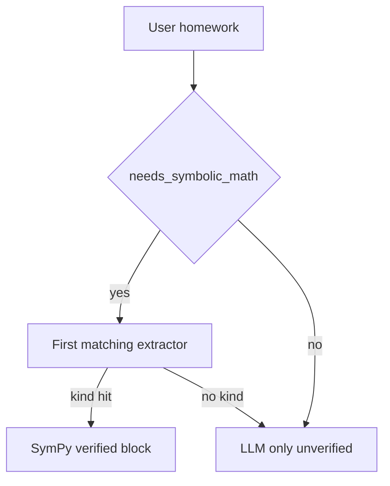

# Recall maths pipeline

Server-side SymPy verifies and samples; the mobile app only renders. Do not add on-device solving.

## Default product path (`MCP_TOOL_LOOP_ENABLED=false`)

1. **Heuristic pre-stream** ([`math_tools/`](../apps/api/app/services/math_tools/)) — if `needs_symbolic_math`, SymPy runs off the event loop and a verified system block is injected (numbers + optional `canonical_fence` for ` ```geometry` / ` ```graph` / ` ```answer `).
2. **LLM stream** — model explains using those values and emits fences.
3. **Post-stream** ([`math_fence.py`](../apps/api/app/services/math_fence.py)) — replace matching geometry/graph/`answer` fences with the canonical fence when present; schema-validate otherwise; densify sparse continuous graphs (default ~96 points — enough for a smooth SVG, small enough that a fallback never dumps a wall of coordinates). At most a handful of fences of each kind are rewritten so one long reply cannot exhaust the shared 5s SymPy budget.
4. **Mobile** — preprocess delimiters, then render: inline `$...$` → native `MathText`; display ` ```math` → KaTeX/MathJax WebView (dev build; tall blocks offer Expand → fullscreen scroll); diagrams → SVG. Crash fallback still draws geometry/graph as SVG (not raw JSON).

Camera math is a specialization of step 1: fixed prompt → vision extract → same SymPy equation path.

## Tool-loop path (`MCP_TOOL_LOOP_ENABLED=true`)

Heuristic pre-solve and web-search injection are skipped. The model may call the `sympy` MCP tool. Tool results that include a `canonical_fence` in `ToolResult.data` are collected into `VerifiedMathBlock` so step 3 still rewrites fences. Treat this path as optional until you intentionally turn the loop on in production.

## Formula emit rule (prompts must agree)

- **Steps / intermediates:** inline `$...$` only (no backticks around `$`, no ` ```math` inside numbered steps).
- **Standalone display:** ` ```math` OK for a final equation on its own lines.
- **Diagrams:** ` ```geometry` / ` ```graph` JSON only — never freehand HTML/SVG/```json for math diagrams.
- **Final algebra answer:** ` ```answer ` with the SymPy solution (post-stream rewrite when a
  canonical answer fence was computed).

## Key files

| Layer | Path |
|-------|------|
| SymPy core | `apps/api/app/services/math_service/` |
| Pre-stream inject | `apps/api/app/services/math_tools/` |
| Post-stream fences | `apps/api/app/services/math_fence.py` |
| Camera OCR | `apps/api/app/services/math_image_extract.py` |
| MCP sympy | `apps/api/app/gateways/mcp/sympy_adapter.py` |
| Prompt hints | `apps/api/app/services/chat/prompt_constants.py` |
| Mobile preprocess | `apps/mobile/lib/markdownPreprocess.ts`, `normalizeImplicitMath.ts` |
| Render | `MathText`, `MathView` / `MathFormulaWebView`, `GeometryBlock`, `FunctionGraphBlock` |

## Curriculum coverage (K–12 through undergrad homework)

The LLM can **talk** about almost any homework. **Verified** work (pre-stream SymPy + canonical fences) only covers the `MathIntent.kind` list in [`math_schemas/`](../apps/api/app/models/math_schemas/) (~25 kinds). Anything else is unverified prose. That is intentional: Golden Rule 7 — the app renders; the server verifies what SymPy can close. Proof-based analysis and abstract algebra stay LLM-only.

[`math_tools/`](../apps/api/app/services/math_tools/) is the feature split: ordered `_INTENT_EXTRACTORS` in `extract.py` plus `kind → _verified_block_*` in `block/`. Do **not** add a second kind table. Do **not** add Skia; display math stays KaTeX/MathJax WebView, inline `MathText`, diagrams `react-native-svg`.

Camera OCR is a **subset** of the kinds below (no square / trapezoid / matrix / series / Newton / solid).

### Verified today

| Band | Covered as verified | How |
|------|---------------------|-----|
| Arithmetic (1–6) | Only if it parses as an **equation** (`1/2+1/3 = x`) or **simplify/factor** | `_extract_equation_intent`, calculus `simplify`. Bare “what is 7×8” often never hits SymPy. |
| Pre-algebra | Fractions/exponents in equations; gcd/lcm/primes/mod | `equation`, `number_theory` |
| Algebra I–II | One equation, systems (≤4), inequalities + shaded region | `equation`, `system`, `inequality` + `number_line` graph |
| Geometry (2D) | Rectangle, square, triangle (base/height), right triangle, SSS, trap, para, circle, sector | geometry fences |
| Geometry (3D) | Cube, rectangular prism, cylinder, cone, sphere, pyramid (volume / surface area) | `solid` |
| Arithmetic / percent / ratio | Bare `7*8`, `15% of 80`, simplify `6:8` | `arithmetic` |
| Trig (evaluate) | `sin(30°)` etc. Equations like `sin(x)=1/2` stay `equation`. Identities / law of sines stay LLM | `trig` |
| Coordinate geometry | Distance, midpoint, slope between two points | `coord` |
| Vectors | Magnitude, dot, cross | `vector` |
| Linear algebra | det, inverse, multiply, rref, eigenvalues (≤4) | `matrix` |
| Calc II (thin) | Taylor, partials, first-order `dsolve`. Polar/parametric/double integrals stay LLM | `calculus` |
| Probability | Binomial PMF, expected value of a list | `probability` |
| Complex / units | Simplify `a+bi`; length/mass/time/temp convert | `complex`, `unit` |
| Graphs | y=f(x), two curves, vertical line, point, axis-aligned ellipse | `graph` / `graph_pair` |
| Precalc / Calc I | simplify, factor, expand, d/dx, ∫, definite ∫, limits, series sum, Newton | `calculus`, `limit`, `series`, `numerical_method` |
| Stats (descriptive) | mean, median, mode, variance, stdev | `statistics` |
| Discrete (intro) | n!, nCr, nPr | `combinatorics` |
| Linear algebra (tiny) | 2×2–4×4 **det** and **inverse** only | `matrix` |



### School-homework gaps (unverified LLM)

Still not a verified kind (the model may answer; it must **not** claim SymPy):

1. **Trig identities / law of sines** — SSS still uses law of cosines only.
2. **Polar / parametric curves** (except axis-aligned ellipse) and **double integrals**.
3. **Linear algebra** beyond 4×4 multiply / rref / eigen (no general NL matrix parsing).
4. **Full unit catalogs** (only common length/mass/time/temp).

New verified homework still lands as **one kind** on the existing seam (`MathIntent.kind` + extractor + `_verified_block_*` + pytest). `math_tools` is a package (`extract.py` registry, `block/` builders, `school.py` extra kinds) — do not add a second kind table.
