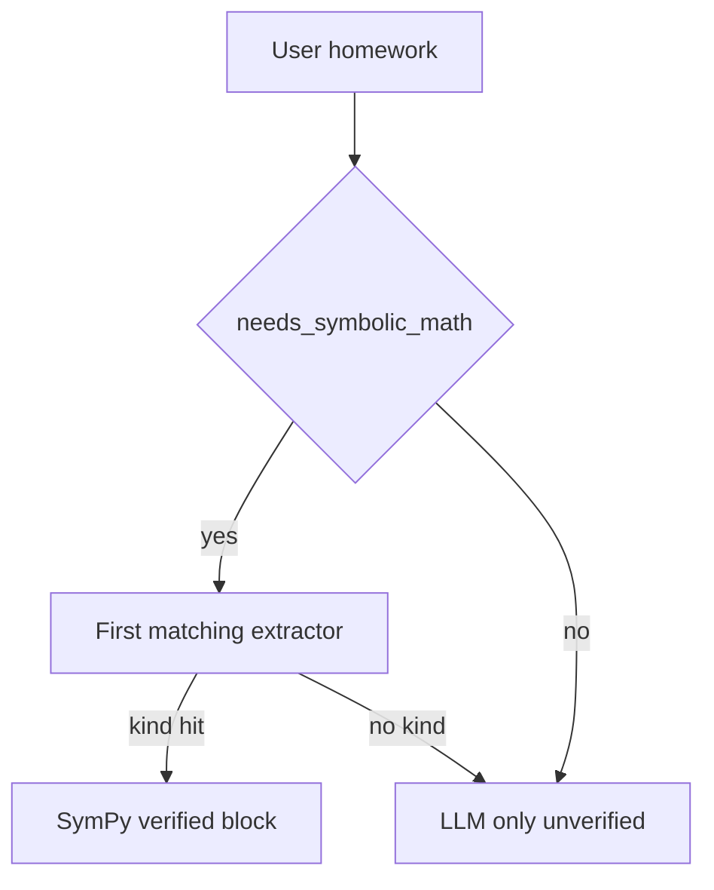

# Recall maths pipeline

Server-side SymPy verifies and samples; the mobile app only renders. Do not add on-device solving.

## Default product path (heuristic SymPy, always)

1. **Heuristic pre-stream** ([`math_tools/`](../apps/api/app/services/math_tools/)) — if `needs_symbolic_math`, SymPy runs in isolated worker slots (default 3; interactive slot wait 2s, then the 5s solve timeout). A verified system block is injected (numbers + `canonical_fence` / `canonical_answer` for ` ```geometry` / ` ```graph` / ` ```answer `). The hint tells the model **not** to emit those fences.
2. **Direct verified reply** — short closed answers and supported plain graph requests can **skip the LLM** through the instant-reply seam. Whole literal requests for supported 2D measurements return the requested answer plus the canonical diagram; closed cube, rectangular-prism, cylinder, cone, sphere, and square-pyramid volume/surface-area requests return one answer with units. The guards require the requested dimensions, units, and quantity to agree with the verified result. An exact AAA drawing returns relative lengths only; an area/perimeter request with angles alone asks for a side length instead of inventing a scale. Closed literal physics requests return the canonical quantity and any existing trajectory directly. Explanations, hints, mixed/qualified requests, camera homework, and requests outside these complete grammars retain the model response path.
3. **LLM stream** (when language adds value) — model answers briefly in Markdown + `$...$`. A reply instruction immediately after the verified working distinguishes supporting solver data from a user request for teaching.
4. **Post-stream** ([`math_fence.py`](../apps/api/app/services/math_fence.py)) — rewrite any leftover geometry/graph/`answer` fences from the model with the canonical body; append missing solver-owned results, avoiding an extra answer card when equivalent math is already visible; schema-validate otherwise; densify sparse continuous graphs (default ~96 points — enough for a smooth SVG, small enough that a fallback never dumps a wall of coordinates). At most a handful of fences of each kind are rewritten so one long reply cannot exhaust the shared 5s SymPy budget. Direct replies run this rewrite in-process (they already carry the fence).
5. **Mobile** — preprocess delimiters, then render: ordinary inline `$...$` → native `MathText`; heavy inline calculus/matrices and display ` ```math` → KaTeX/MathJax WebView (`react-native-webview` in dev builds or `@expo/dom-webview` in Expo Go; tall blocks offer Expand → fullscreen scroll); diagrams → SVG. Crash fallback still draws geometry/graph as SVG (not raw JSON).

Camera math is a specialization of step 1: an image with the scanner prompt or another recognized math caption goes through Mathpix when configured, with vision fallback for semantic or uncertain reads, then the supported SymPy extraction path. A plain photo with no math caption does not automatically trigger this verified OCR path. Image turns retain the model response path.

**KaTeX cold start (deliberate):** `lib/katexRender.ts` statically imports KaTeX plus its CSS. That bundle loads on the first markdown message that can reach `MathView` / `AnswerBlock`, whether or not the reply contains display math. MathJax stays behind a dynamic `import()` for `multline`/`eqnarray` only. Do not lazy-load KaTeX to “fix” chat start — the sync path is the documented trade-off (`mathHtml.ts`). Vendored CSS/fonts must match the installed KaTeX renderer; `lib/vendor/__tests__/katexParity.test.ts` checks version, CSS, and font parity.

## Tool-loop path (`MCP_TOOL_LOOP_ENABLED=true`, default)

Heuristic pre-solve and web-search injection **still run**. The model may also call the `sympy` / `web_search` / `calendar` / `generate_image` tools for follow-ups. The math-triggered loop is skipped when `extract_math_intent` is `None` (bare detection without an extractor used to burn the full timeout). Tool results that include a `canonical_fence` / `canonical_answer` in `ToolResult.data` are collected into `VerifiedMathBlock` so post-stream still rewrites or appends fences. Direct verified replies skip this loop. Tool **content** is prose + verified numbers, not fence JSON. Plain replies without fences skip the post-stream SymPy rewrite (`needs_math_fence_validate`).

## Formula emit rule (prompts must agree)

- **Answer length:** give the result once with only the key reasoning needed. Short mode applies to math too. Full derivations follow explicit requests for steps, explanation, or proof; a hint/practice request should not reveal the full answer. Brevity must preserve domains, branches, units, and constants of integration.
- **Simple roots/powers:** one exact equality chain and an optional approximation are usually enough. Group fractional exponents (`9^{1/6}`); avoid duplicated answer headings and Note/Tip cards that restate the result.
- **Steps / intermediates:** inline `$...$` only (no backticks around `$`, no ` ```math` inside numbered steps).
- **Standalone display:** ` ```math` OK for a final equation on its own lines.
- **Diagrams:** Recall attaches ` ```geometry` / ` ```graph` from `canonical_fence`. The model describes the figure in words (`$...$`); it must not emit diagram JSON.
- **Final algebra answer:** Recall attaches ` ```answer ` from `canonical_answer` after the stream. The model writes the result in `$...$`.

## Composer input (mobile)

The stored user text preserves what the composer submitted. Explicit math controls may normalize that text before submission; OCR and solver context augment the model input separately:

- **Symbol toolbar** (`MathKeyboardBar` / `mathKeyboardSymbols.ts`) inserts LaTeX snippets (`$...$` when the caret is outside math).
- **Ordinary typing and native paste** preserve the exact input and native caret. Autocorrect and spellcheck stay disabled so notation such as `sqrt` and assignment expressions cannot be rewritten while typing.
- **Explicit math keypad / Paste controls** opt into formatted math editing. `mathPasteNormalize.ts` maps pasted Unicode math glyphs to LaTeX (the same glyph set spirit as `_UNICODE_OP_SUBS` in `math_service/parse.py`). The in-app Paste button reads clipboard text only; it does not import an image. Use Scan Math or a photo attachment for image input.
- **Scan Math** captures a camera frame or imports a photo. Imported photos fit inside the preview so the initial crop contains the full image; camera previews retain their fill/crop behavior. Solve crops and sends immediately, using the existing draft or the default math prompt. There is no OCR text-review step in the current mobile scanner.
- Backslashes, `_`, and `*` inside math are protected during Markdown preprocessing and restored at the native/KaTeX parser boundary, so Markdown cannot consume math escapes or reinterpret subscripts/multiplication as emphasis.

## Key files

| Layer | Path |
|-------|------|
| SymPy core | `apps/api/app/services/math_service/` |
| Physics templates and direct guard | `apps/api/app/services/physics_solver.py`, `math_tools/physics.py`, `math_tools/direct_physics.py` |
| Pre-stream inject | `apps/api/app/services/math_tools/` |
| Post-stream fences | `apps/api/app/services/math_fence.py` |
| Camera OCR | `apps/api/app/services/math_ocr.py`, `math_image_extract.py` |
| MCP sympy | `apps/api/app/gateways/mcp/sympy_adapter.py` |
| Prompt hints | `apps/api/app/services/chat/prompt_constants/` (`math.py`, …) |
| Mobile preprocess | `apps/mobile/lib/markdown/markdownPreprocess.ts`, `apps/mobile/lib/normalizeImplicitMath.ts` |
| Composer math input | `mathPasteNormalize.ts`, `mathKeyboardSymbols.ts`, `MathKeyboardBar` |
| Render | `MathText`, `MathView` / `MathFormulaWebView`, `GeometryBlock`, `FunctionGraphBlock` |

## Curriculum coverage (K–12 through undergrad homework)

The LLM can **talk** about almost any homework. **Verified** work (pre-stream SymPy + canonical fences) only covers the `MathIntent.kind` list in [`schemas/math/`](../apps/api/app/models/schemas/math/) (36 kinds). Anything else is unverified prose. That is intentional: Golden Rule 7 — the app renders; the server verifies what SymPy can close. Proof-based analysis and abstract algebra stay LLM-only.

[`math_tools/`](../apps/api/app/services/math_tools/) is the feature split: ordered `_INTENT_EXTRACTORS` in `extract.py` plus `kind → _verified_block_*` in `block/`. Do **not** add a second kind table. Do **not** add Skia; display math stays KaTeX/MathJax WebView, inline `MathText`, diagrams `react-native-svg`.

Camera OCR is a **subset** of the kinds below (no square / trapezoid / matrix / series / Newton / solid).

### Verified today

| Band | Covered as verified | How |
|------|---------------------|-----|
| Arithmetic (1–6) | Bare digits+ops when `bare_arithmetic_expr` agrees (`7*8`, `8-8*2`, cued `what is 9/9`). Standalone subtraction such as `2-6` is verified. Lone-slash input (`9/9`) still needs a compute cue; phone/date shapes and ranges in prose stay outside this shortcut. Equations (`1/2+1/3 = x`) and simplify/factor too. | `arithmetic`, `_extract_equation_intent`, calculus `simplify` |
| Pre-algebra | Fractions/exponents in equations; gcd/lcm/primes/mod | `equation`, `number_theory` |
| Algebra I–II | One equation, systems (≤4), inequalities + number-line intervals; affine two-variable shaded half-planes | `equation`, `system`, `inequality` + `number_line` / `inequality` graph |
| Geometry (2D) | Rectangle, square, triangle (base/height), right triangle, SSS, trap, para, circle, sector | geometry fences |
| Geometry (3D) | Cube, rectangular prism, cylinder, cone, sphere, pyramid (volume / surface area). Numbers only — no 3D SVG fence. | `solid` |
| Arithmetic / percent / ratio | Bare `7*8` / `8-8*2`; `15% of 80`; simplify `6:8` | `arithmetic` |
| Trig (evaluate / equations) | `sin(30°)` etc. Equations like `sin(x)=1/2` return every real periodic branch with an integer parameter. Unsupported explicit domains and unresolved solution sets stay on the model path. Identities stay LLM. AAA triangles use law of sines with explicitly relative lengths; physical area/perimeter needs a side length. | `trig`, `equation`, `triangle_sides` |
| Coordinate geometry | Distance, midpoint, slope between two points | `coord` |
| Vectors | Magnitude, dot, cross | `vector` |
| Physics (narrow) | 1D gravity kinematics, projectile range/max height (vacuum formula when no height; quadratic time-of-flight when `h0` is given), scalar F=ma, kinetic/potential energy, work, power | `kinematics`, `projectile`, `force`, `energy`; trajectory `graph` fences only for kinematics/projectile. Gate = union of those extractor cues. `moon`/`mars` are whole tokens. Unlabeled lengths are not launch height. Complete supported literal requests use `direct_physics.py`; other physics phrasing retains the model path. |
| Linear algebra | 2×2–4×4 det and inverse | `matrix` |
| Calc II (thin) | Taylor / Maclaurin, partials, first-order `dsolve`, 2nd/3rd derivative. Polar/parametric/double integrals stay LLM | `calculus` |
| Probability | Binomial PMF, expected value of a list | `probability` |
| Complex / units | Simplify `a+bi`; Pint unit convert (SI case-sensitive symbols) | `complex`, `unit` |
| Graphs | y=f(x), two curves, vertical line, point, axis-aligned ellipse | `graph` / `graph_pair` |
| Precalc / Calc I | simplify, factor, expand, d/dx, ∫, definite ∫, limits, series sum, Newton | `calculus`, `limit`, `series`, `numerical_method` |
| Stats (descriptive) | mean, median, mode, variance, stdev | `statistics` |
| Discrete (intro) | n!, nCr, nPr | `combinatorics` |

**Closed physics replies:** `direct_physics.py` matches complete literal requests for a drop from rest (time to ground, velocity/speed/height at a stated time, or free-fall acceleration), a level-ground projectile's range/maximum height with a launch angle strictly between 0° and 90°, scalar F=ma with two known quantities, kinetic/potential energy, work, power, and average speed. It compares the requested operation, values, and units with a snapshot of the exact verified intent, without solving again. The answer retains the solver's precision and any trajectory. Physics inputs convert to SI; average speed retains the supplied distance/time unit pairing. Unit-symbol case and signed values are preserved; signed free-fall velocity/acceleration explicitly state that upward is positive. Explicit gravity is supported in the closed gravity templates; otherwise the solver uses 9.81 m/s². Extra conditions, teaching requests, images, and unsupported phrasing retain the model path.



### School-homework gaps (unverified LLM)

Still not a verified kind (the model may answer; it must **not** claim a verified result):

1. **Trig identities** — remain LLM-only. **Angle-only triangles** (AAA summing to 180°) are verified via the law of sines with explicit `relative_lengths` provenance. Their diagrams omit a physical area; a measured side is required to determine area or perimeter. SSS still uses law of cosines for angles-from-sides.
2. **Polar / parametric curves** (except axis-aligned ellipse) and **double integrals**.
3. **Linear algebra** beyond 4×4 det / inverse (no multiply / rref / eigen; no general NL matrix parsing).
4. **Unit-symbol casing** — Pint already covers energy/force/pressure/etc. Symbols that need uppercase (`J`, `N`, `Pa`) must be passed through with original case (lowercasing before lookup used to drop them). `fl-oz` aliases to Pint `fluid_ounce`.
5. **Physics beyond the verified templates** — friction, tension, normal-force systems, momentum/collisions, rotation, circuits, waves, thermodynamics, relativity, coupled ODEs, and free-body diagrams remain LLM-only.

New verified homework still lands as **one kind** on the existing seam (`MathIntent.kind` + extractor + `_verified_block_*` + pytest). `math_tools` is a package (`extract.py` registry, `block/` builders, `school.py` extra kinds) — do not add a second kind table.

## Math quality review — September 12, 2026

This pass checked the path from user notation through extraction and verified answers, plus native rendering and streaming. The regression matrix lives in `test_math_category_regressions.py` and `test_math_review_geometry_calculus.py`; these tests use no model calls.

| Part | Representative checks and corrections |
|------|----------------------------------------|
| Arithmetic, fractions, roots, powers | Order of operations, percentages, sixth root of 9, nested radicals, grouping a fraction under division/powers, negative substitution, decimal ratios. |
| Algebra | Linear and quadratic equations, both roots, systems; readable fractions and fractional exponents. |
| Trigonometry | Preserve the entire argument and explicit radians. Reject extraction that would drop a leading multiplier or second trig term. |
| Calculus | Respect the requested variable/differential; include `+ C` for indefinite integrals; preserve one-sided limit direction; distinguish a nonexistent two-sided limit from positive infinity; do not certify an unevaluated or oscillating divergent series as a sum. |
| Geometry | Canonical area/perimeter/diagonal matches the requested quantity for supported shapes. Base and height alone cannot certify a general triangle or trapezoid perimeter. |
| Statistics and probability | Fractions and scientific notation remain whole data values; sample/population variance, binomial probability, raw-list expected value. Weighted data and fractional discrete parameters cannot silently become a different calculation. |
| Discrete and matrices | Factorial, combinations, integer number theory, exact determinant/inverse; singular inverses and invalid counts cannot become numeric answers. |
| Graphs | Preserve the direct verified function-graph path and its existing regression coverage. |
| Rendering | Callout math uses the same notation parser; complete streamed formulas keep their escapes; unfinished explicit math is held until renderable. Fractional powers and root indices are readable; stacked fraction bars group their contents without invented parentheses. Heavy calculus/matrix notation gets a full-width typesetting host. Multi-branch native answers retain each branch and its parameter conditions in bounded horizontal scroll hosts. |

The verified extractor is deliberately narrower than general mathematical language. Combined/prefixed trig expressions, weighted expectations/statistics, some natural-language geometry forms, and the school-homework gaps above still use the language-model path. Bare numeric trig shorthand such as `sin(30)` retains the existing degrees convention; specify radians explicitly when intended. The separate Vite web client does not yet have parity with the mobile math renderer.

Prompt tests verify that brevity and formatting instructions reach the model; they do not establish how every live provider will follow those instructions. Visual verification used the iOS simulator with representative formulas, not an exhaustive proof of every possible LaTeX expression or an Android device run.
