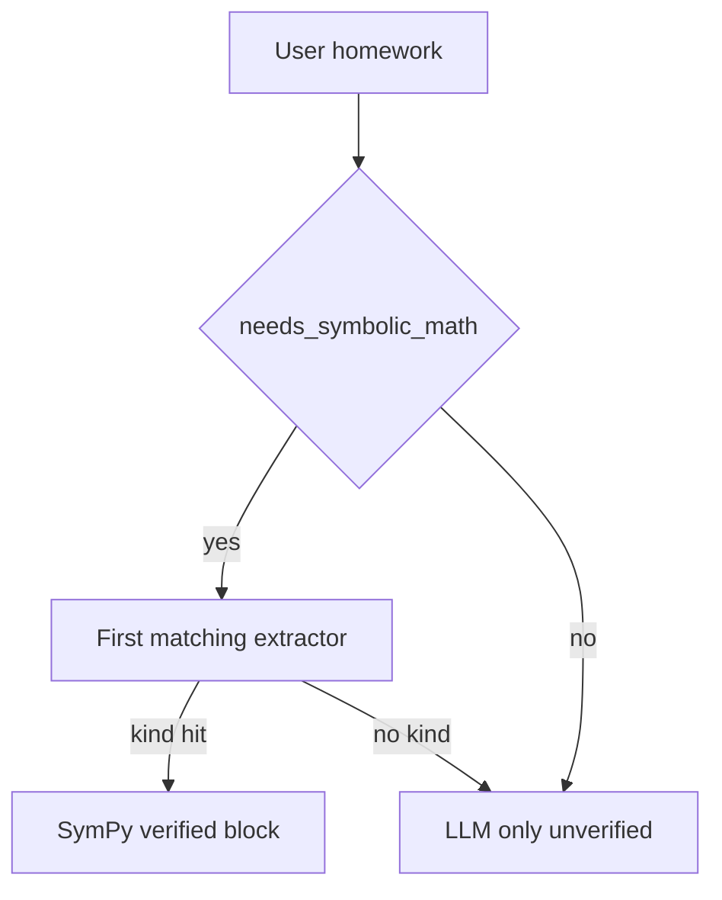

# Recall maths pipeline

Server-side SymPy verifies and samples; the mobile app only renders. Do not add on-device solving.

## Default product path (heuristic SymPy, always)

1. **Heuristic pre-stream** ([`math_tools/`](../apps/api/app/services/math_tools/)) — if `needs_symbolic_math`, SymPy runs off the event loop and a verified system block is injected (numbers + `canonical_fence` / `canonical_answer` for ` ```geometry` / ` ```graph` / ` ```answer `). The hint tells the model **not** to emit those fences.
2. **LLM stream** — model explains in Markdown + `$...$`.
3. **Post-stream** ([`math_fence.py`](../apps/api/app/services/math_fence.py)) — rewrite any leftover geometry/graph/`answer` fences from the model with the canonical body; append missing solver-owned fences so the client always gets the answer pill and diagram; schema-validate otherwise; densify sparse continuous graphs (default ~96 points — enough for a smooth SVG, small enough that a fallback never dumps a wall of coordinates). At most a handful of fences of each kind are rewritten so one long reply cannot exhaust the shared 5s SymPy budget.
4. **Mobile** — preprocess delimiters, then render: inline `$...$` → native `MathText`; display ` ```math` → KaTeX/MathJax WebView (dev build; tall blocks offer Expand → fullscreen scroll); diagrams → SVG. Crash fallback still draws geometry/graph as SVG (not raw JSON).

Camera math is a specialization of step 1: fixed prompt → vision extract → same SymPy equation path.

**KaTeX cold start (deliberate):** `lib/katexRender.ts` statically imports KaTeX plus its CSS. That bundle loads on the first markdown message that can reach `MathView` / `AnswerBlock`, whether or not the reply contains display math. MathJax stays behind a dynamic `import()` for `multline`/`eqnarray` only. Do not lazy-load KaTeX to “fix” chat start — the sync path is the documented trade-off (`mathHtml.ts`).

## Tool-loop path (`MCP_TOOL_LOOP_ENABLED=true`, default)

Heuristic pre-solve and web-search injection **still run**. The model may also call the `sympy` / `web_search` / `calendar` / `generate_image` tools for follow-ups. Tool results that include a `canonical_fence` / `canonical_answer` in `ToolResult.data` are collected into `VerifiedMathBlock` so step 3 still rewrites or appends fences. Tool **content** is prose + verified numbers, not fence JSON.

## Formula emit rule (prompts must agree)

- **Steps / intermediates:** inline `$...$` only (no backticks around `$`, no ` ```math` inside numbered steps).
- **Standalone display:** ` ```math` OK for a final equation on its own lines.
- **Diagrams:** Recall attaches ` ```geometry` / ` ```graph` from `canonical_fence`. The model describes the figure in words (`$...$`); it must not emit diagram JSON.
- **Final algebra answer:** Recall attaches ` ```answer ` from `canonical_answer` after the stream. The model writes the result in `$...$`.

## Composer input (mobile)

The API persists and forwards the user's message **verbatim**. Capture happens in the composer:

- **Symbol toolbar** (`MathKeyboardBar` / `mathKeyboardSymbols.ts`) inserts LaTeX snippets (`$...$` when the caret is outside math).
- **Paste** (`mathPasteNormalize.ts`) maps Unicode math glyphs to LaTeX when a change looks like a paste (same glyph set spirit as `_UNICODE_OP_SUBS` in `math_service/parse.py`). Image-only clipboard → existing camera OCR, not a second recognizer.
- Bare `_` / `*` inside `$...$` are protected in `markdownPreprocess.ts` so markdown-it cannot turn subscripts/multiplication into emphasis.

## Key files

| Layer | Path |
|-------|------|
| SymPy core | `apps/api/app/services/math_service/` |
| Physics templates | `apps/api/app/services/physics_solver.py`, `math_tools/physics.py` |
| Pre-stream inject | `apps/api/app/services/math_tools/` |
| Post-stream fences | `apps/api/app/services/math_fence.py` |
| Camera OCR | `apps/api/app/services/math_image_extract.py` |
| MCP sympy | `apps/api/app/gateways/mcp/sympy_adapter.py` |
| Prompt hints | `apps/api/app/services/chat/prompt_constants/` (`math.py`, …) |
| Mobile preprocess | `apps/mobile/lib/markdownPreprocess.ts`, `normalizeImplicitMath.ts` |
| Composer math input | `mathPasteNormalize.ts`, `mathKeyboardSymbols.ts`, `MathKeyboardBar` |
| Render | `MathText`, `MathView` / `MathFormulaWebView`, `GeometryBlock`, `FunctionGraphBlock` |

## Curriculum coverage (K–12 through undergrad homework)

The LLM can **talk** about almost any homework. **Verified** work (pre-stream SymPy + canonical fences) only covers the `MathIntent.kind` list in [`math_schemas/`](../apps/api/app/models/math_schemas/) (~25 kinds). Anything else is unverified prose. That is intentional: Golden Rule 7 — the app renders; the server verifies what SymPy can close. Proof-based analysis and abstract algebra stay LLM-only.

[`math_tools/`](../apps/api/app/services/math_tools/) is the feature split: ordered `_INTENT_EXTRACTORS` in `extract.py` plus `kind → _verified_block_*` in `block/`. Do **not** add a second kind table. Do **not** add Skia; display math stays KaTeX/MathJax WebView, inline `MathText`, diagrams `react-native-svg`.

Camera OCR is a **subset** of the kinds below (no square / trapezoid / matrix / series / Newton / solid).

### Verified today

| Band | Covered as verified | How |
|------|---------------------|-----|
| Arithmetic (1–6) | Only if it parses as an **equation** (`1/2+1/3 = x`) or **simplify/factor** | `_extract_equation_intent`, calculus `simplify`. Bare “what is 7×8” often never hits SymPy. |
| Pre-algebra | Fractions/exponents in equations; gcd/lcm/primes/mod | `equation`, `number_theory` |
| Algebra I–II | One equation, systems (≤4), inequalities + shaded region | `equation`, `system`, `inequality` + `number_line` graph |
| Geometry (2D) | Rectangle, square, triangle (base/height), right triangle, SSS, trap, para, circle, sector | geometry fences |
| Geometry (3D) | Cube, rectangular prism, cylinder, cone, sphere, pyramid (volume / surface area) | `solid` |
| Arithmetic / percent / ratio | Bare `7*8`, `15% of 80`, simplify `6:8` | `arithmetic` |
| Trig (evaluate) | `sin(30°)` etc. Equations like `sin(x)=1/2` stay `equation`. Identities stay LLM. AAA triangles use law of sines (relative units). | `trig`, `triangle_sides` |
| Coordinate geometry | Distance, midpoint, slope between two points | `coord` |
| Vectors | Magnitude, dot, cross | `vector` |
| Physics (narrow) | 1D gravity kinematics, vacuum projectile range/max height, scalar F=ma, kinetic/potential energy, work, power | `kinematics`, `projectile`, `force`, `energy`; computed trajectory points render as `graph` fences |
| Linear algebra | 2×2–4×4 det and inverse | `matrix` |
| Calc II (thin) | Taylor, partials, first-order `dsolve`. Polar/parametric/double integrals stay LLM | `calculus` |
| Probability | Binomial PMF, expected value of a list | `probability` |
| Complex / units | Simplify `a+bi`; length/mass/time/temp convert | `complex`, `unit` |
| Graphs | y=f(x), two curves, vertical line, point, axis-aligned ellipse | `graph` / `graph_pair` |
| Precalc / Calc I | simplify, factor, expand, d/dx, ∫, definite ∫, limits, series sum, Newton | `calculus`, `limit`, `series`, `numerical_method` |
| Stats (descriptive) | mean, median, mode, variance, stdev | `statistics` |
| Discrete (intro) | n!, nCr, nPr | `combinatorics` |



### School-homework gaps (unverified LLM)

Still not a verified kind (the model may answer; it must **not** claim SymPy):

1. **Trig identities** — remain LLM-only. **Angle-only triangles** (AAA summing to 180°) are verified via the law of sines with relative side units (not invented cm). SSS still uses law of cosines for angles-from-sides.
2. **Polar / parametric curves** (except axis-aligned ellipse) and **double integrals**.
3. **Linear algebra** beyond 4×4 det / inverse (no multiply / rref / eigen; no general NL matrix parsing).
4. **Full unit catalogs** (only common length/mass/time/temp).
5. **Physics beyond the verified templates** — friction, tension, normal-force systems, momentum/collisions, rotation, circuits, waves, thermodynamics, relativity, coupled ODEs, and free-body diagrams remain LLM-only.

New verified homework still lands as **one kind** on the existing seam (`MathIntent.kind` + extractor + `_verified_block_*` + pytest). `math_tools` is a package (`extract.py` registry, `block/` builders, `school.py` extra kinds) — do not add a second kind table.
