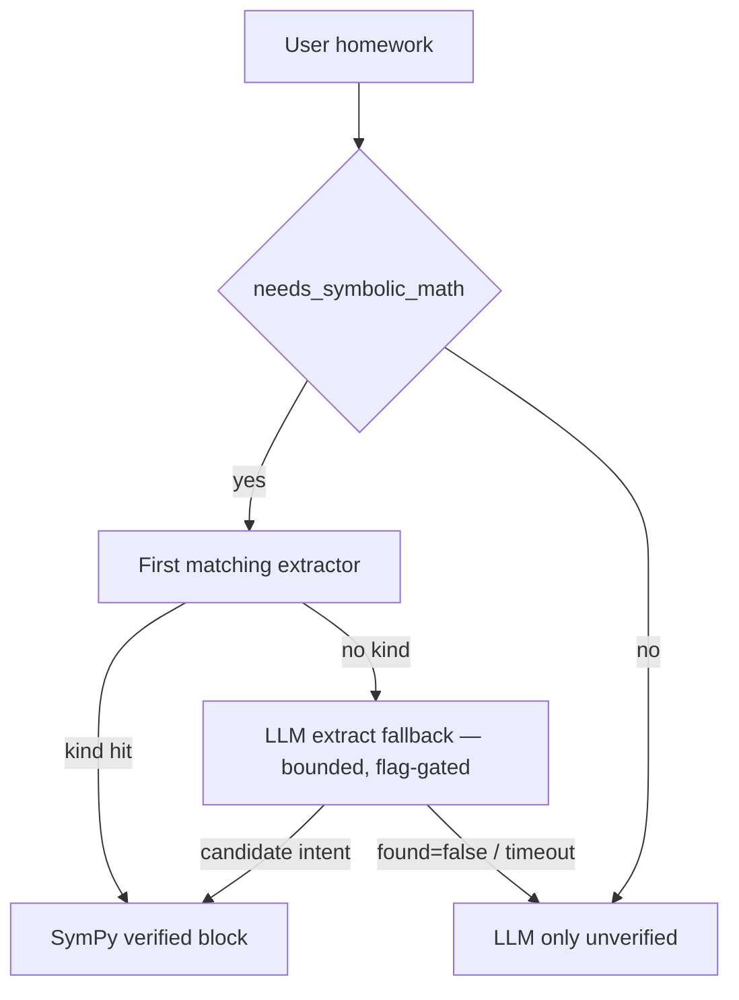

# Recall maths pipeline

Server-side SymPy verifies and samples; the mobile app only renders. Do not add on-device solving.

## Default product path (heuristic SymPy, always)

1. **Heuristic pre-stream** ([`math/tools/`](../apps/api/app/modules/math/tools/)) — if `needs_symbolic_math`, SymPy runs in isolated worker slots (default 3; interactive slot wait 2s, then the 5s solve timeout). A verified system block is injected (numbers + `canonical_fence` / `canonical_answer` for ` ```geometry` / ` ```graph` / ` ```answer `). The hint tells the model **not** to emit those fences. When the gate fires but no regex extractor matches, one bounded structured-extraction call on `title-model` (`math/tools/llm_extract.py`, flag `math_llm_extract_enabled`, 2.5s timeout, no fallback retry) proposes a candidate `MathIntent` — it still has to survive SymPy, and only that already-failing path pays for the call.
2. **Direct verified reply** — short closed answers and supported plain graph requests can **skip the LLM** through the instant-reply seam. Whole literal requests for supported 2D measurements return the requested answer plus the canonical diagram; closed cube, rectangular-prism, cylinder, cone, sphere, and square-pyramid volume/surface-area requests return one answer with units. The guards require the requested dimensions, units, and quantity to agree with the verified result. An exact AAA drawing returns relative lengths only; an area/perimeter request with angles alone asks for a side length instead of inventing a scale. Closed literal physics requests return the canonical quantity and any existing trajectory directly. Linear, pure-power, and quadratic **equation lessons** are server-rendered from verified `key_steps` (Given + one transformation per line + the ```answer chip) when the style is Detailed, the user asks for steps, or Balanced and the trace has two or more operations. Short / “just the answer” stays a chip. Explanations that have no trace, hints, mixed/qualified requests, camera homework, and requests outside these complete grammars retain the model response path.
3. **LLM stream** (when language adds value) — model answers briefly in Markdown + `$...$`. A reply instruction immediately after the verified working distinguishes supporting solver data from a user request for teaching.
4. **Post-stream** ([`math/fence.py`](../apps/api/app/modules/math/fence.py)) — rewrite any leftover geometry/graph/`answer` fences from the model with the canonical body; append missing solver-owned results, avoiding an extra answer card when equivalent math is already visible (string fast-path first, then a SymPy equivalence audit — `$0.5$` vs `\frac{1}{2}` — capped at two prose-span parses inside the same worker budget); schema-validate otherwise; densify sparse continuous graphs (default ~96 points — enough for a smooth SVG, small enough that a fallback never dumps a wall of coordinates). At most a handful of fences of each kind are rewritten so one long reply cannot exhaust the shared 5s SymPy budget. Direct replies run this rewrite in-process (they already carry the fence). `*Couldn't verify this with SymPy.*` is an honest label when the gate fired, SymPy produced nothing, **and** the reply contains math. It is **not** stamped on prose with no math (the old anatomy / “show me” class) and is not the outcome for verified arithmetic, graphs, or physics that now extract.
5. **Mobile** — preprocess delimiters, then render: ordinary inline `$...$` → native `MathText` (stacked fractions, radicals, red `\cancel` slash on divide steps); display ` ```math` and heavy answers → **MathJax-SVG** (`MathSvgView` + `lib/math/svgMath.ts`: `mathjax-full` converts LaTeX to SVG lazily behind an LRU cache, rendered via `react-native-svg` — no WebView, no flicker; conversion failure falls back to readable `MathText`); geometry diagrams → SVG. Native builds render function cards, the expanded graph explorer, number-line solutions, and two-dimensional inequality regions with **Skia**. The expanded explorer (`components/rich/skia/SkiaGraphExplorer.tsx`) adds pinch/pan/double-tap on the UI thread via Reanimated worklets (`lib/math/graphWorklets.ts`). All Skia entry points are lazy and pass through `isSkiaAvailable()`; the SVG canvas remains the Expo Go / stale-client / load-failure fallback. Algebra ` ```answer ` uses the chat-window background, not a gray pill. Crash fallback still draws geometry/graph as SVG (not raw JSON).

Camera math is a specialization of step 1: an image with the scanner prompt or another recognized math caption goes through Mathpix when configured, with vision fallback for semantic or uncertain reads, then the supported SymPy extraction path. A plain photo with no math caption does not automatically trigger this verified OCR path. Image turns retain the model response path.

**Display math is MathJax-SVG, not a WebView.** `mathjax-full` (tex → svg) loads behind a dynamic `import()` on the first display-math block, and converted formulas sit in an LRU cache (`lib/math/svgMath.ts`), so chat cold start pays nothing. The old KaTeX/MathJax WebView host (`MathFormulaWebView`, `lib/katexRender.ts`, `lib/math/html*.ts`) is deleted; KaTeX remains only as a `lib/printDocument.ts` dependency. Native Skia math canvases are likewise lazy (`React.lazy` + `isSkiaAvailable()`), so Expo Go and non-graph chats never bundle or probe them.

## Tool-loop path (`MCP_TOOL_LOOP_ENABLED=true`, default)

Heuristic pre-solve and web-search injection **still run**. The model may also call the `sympy` / `web_search` / `calendar` / `generate_image` tools for follow-ups. The math-triggered loop is skipped when `extract_math_intent` is `None` (bare detection without an extractor used to burn the full timeout). Tool results that include a `canonical_fence` / `canonical_answer` in `ToolResult.data` are collected into `VerifiedMathBlock` so post-stream still rewrites or appends fences. Direct verified replies skip this loop. Tool **content** is prose + verified numbers, not fence JSON. Plain replies without fences skip the post-stream SymPy rewrite (`needs_math_fence_validate`).

## Formula emit rule (prompts must agree)

- **Answer length:** give the result once with only the key reasoning needed. Short mode applies to math too. Full derivations follow explicit requests for steps, explanation, or proof; a hint/practice request should not reveal the full answer. Brevity must preserve domains, branches, units, and constants of integration.
- **Simple roots/powers:** one exact equality chain and an optional approximation are usually enough. Group fractional exponents (`9^{1/6}`); avoid duplicated answer headings and Note/Tip cards that restate the result.
- **Steps / intermediates:** one transformation per numbered step (label, then formula alone on the next `$...$` line). Inverse operations are for equations, not a universal method. Inline `$...$` only (no backticks around `$`, no ` ```math` inside numbered steps).
- **Standalone display:** ` ```math` OK for a final equation on its own lines.
- **Diagrams:** Recall attaches ` ```geometry` / ` ```graph` from `canonical_fence`. The model describes the figure in words (`$...$`); it must not emit diagram JSON.
- **Final algebra answer:** Recall attaches ` ```answer ` from `canonical_answer` after the stream. The model writes the result in `$...$`.

## Composer input (mobile)

The stored user text preserves what the composer submitted. Explicit math controls may normalize that text before submission; OCR and solver context augment the model input separately:

- **Symbol toolbar** (`MathKeyboardBar` / `mathKeyboardSymbols.ts`) inserts LaTeX snippets (`$...$` when the caret is outside math).
- **Ordinary typing and native paste** preserve the exact input and native caret. Autocorrect and spellcheck stay disabled so notation such as `sqrt` and assignment expressions cannot be rewritten while typing.
- **Explicit math keypad / Paste controls** opt into formatted math editing. `mathPasteNormalize.ts` maps pasted Unicode math glyphs to LaTeX (the same glyph set spirit as `_UNICODE_OP_SUBS` in `math/solve/parse.py`). The in-app Paste button reads clipboard text only; it does not import an image. Use Scan Math or a photo attachment for image input.
- **Scan Math** captures a camera frame or imports a photo. Imported photos fit inside the preview so the initial crop contains the full image; camera previews retain their fill/crop behavior. Solve crops and sends immediately, using the existing draft or the default math prompt. There is no OCR text-review step in the current mobile scanner.
- Backslashes, `_`, and `*` inside math are protected during Markdown preprocessing and restored at the native/MathJax-SVG parser boundary, so Markdown cannot consume math escapes or reinterpret subscripts/multiplication as emphasis.

## Key files

| Layer | Path |
|-------|------|
| SymPy core | `apps/api/app/modules/math/solve/` |
| Physics (peer subject) | `apps/api/app/modules/physics/` — `solver.py`, `extract.py`, `direct.py`, `block.py` |
| Pre-stream inject | `apps/api/app/modules/math/tools/` |
| Post-stream fences | `apps/api/app/modules/math/fence.py` |
| Camera OCR | `apps/api/app/modules/math/ocr.py`, `apps/api/app/modules/math/image_extract.py` |
| MCP sympy | `apps/api/app/modules/math/tool.py` |
| Prompt hints | `apps/api/app/services/chat/prompt_constants/` (`math.py`, …) |
| Mobile preprocess | `apps/mobile/lib/markdown/markdownPreprocess.ts`, `apps/mobile/lib/math/normalizeImplicit.ts` |
| Composer math input | `apps/mobile/lib/math/pasteNormalize.ts`, `keyboardSymbols.ts`, `components/chat/MathKeyboardBar.tsx` |
| Render | `MathText`, `MathView` / `MathSvgView` (MathJax-SVG), `GeometryBlock`, `FunctionGraphBlock` + `rich/skia/` graph, number-line, and inequality canvases |

## Curriculum coverage (K–12 through undergrad homework)

The LLM can **talk** about almost any homework. **Verified** work (pre-stream SymPy + canonical fences) covers two disjoint kind spaces: the `MathIntent.kind` list in [`schemas/math/intent.py`](../apps/api/app/models/schemas/math/intent.py) (**32 kinds**) and the separate `PhysicsIntent.kind` list in [`schemas/physics/intent.py`](../apps/api/app/models/schemas/physics/intent.py) (**20 kinds**) — physics is a peer subject, not a `MathIntent` kind (see [SUBJECT_SEPARATION_TICKETS.md](./SUBJECT_SEPARATION_TICKETS.md)). Anything else is unverified prose. That is intentional: Golden Rule 7 — the app renders; the server verifies what SymPy can close. Proof-based analysis and abstract algebra stay LLM-only. Count kinds from those Literals, not from this table.

[`math/tools/`](../apps/api/app/modules/math/tools/) is the feature split: ordered `_INTENT_EXTRACTORS` in `extract.py` plus `kind → _verified_block_*` in `block/`. Do **not** add a second kind table. Rendering: inline `MathText`, display math MathJax-SVG (`MathSvgView`), geometry diagrams `react-native-svg`, and native math graph surfaces Skia (`rich/skia/`, with SVG fallback).

Camera OCR is a **subset** of the kinds below (no square / trapezoid / matrix / series / Newton / solid).

### Verified today

| Band | Covered as verified | How |
|------|---------------------|-----|
| Arithmetic (1–6) | Bare digits+ops when `bare_arithmetic_expr` agrees (`7*8`, `8-8*2`, cued `what is 9/9`). Standalone subtraction such as `2-6` is verified. Lone-slash input (`9/9`) still needs a compute cue; phone/date shapes and ranges in prose stay outside this shortcut. Equations (`1/2+1/3 = x`) and simplify/factor too. | `arithmetic`, `_extract_equation_intent`, calculus `simplify` |
| Pre-algebra | Fractions/exponents in equations; gcd/lcm/primes/mod | `equation`, `number_theory` |
| Algebra I–II | One equation, systems (≤4), inequalities + number-line intervals; affine two-variable shaded half-planes. Linear / pure-power / quadratic **lessons** from `key_steps` when Detailed, “show steps”, or Balanced with 2+ ops. | `equation`, `system`, `inequality` + `number_line` / `inequality` graph |
| Geometry (2D) | Rectangle, square, triangle (base/height), right triangle, SSS, trap, para, circle, sector | geometry fences |
| Geometry (3D) | Cube, rectangular prism, cylinder, cone, sphere, pyramid (volume / surface area). Numbers only — no 3D SVG fence. | `solid` |
| School templates | `15% of 80`; increase/decrease/markup by `%`; `what percent of`; percent change from A to B; discount / `with tax`; simplify `6:8`; split a total in `a:b`; AP/GP nth term and first-N sum; infinite GP (`\|r\|<1`); annual simple/compound interest and present value; union/intersection/difference of two `{…}` sets; work-together (two hour-times); two-part `%` mixture; `twice as many` + together + one total; unit rate; three-number direct/inverse proportion; rounding to decimal places or sig figs | `arithmetic` (`school.py`) |
| Trig (evaluate / equations) | `sin(30°)` etc. Equations like `sin(x)=1/2` return every real periodic branch with an integer parameter. Unsupported explicit domains and unresolved solution sets stay on the model path. Identities (`show that` / `prove that` / `identity`) certify only when lhs−rhs is identically 0. AAA triangles use law of sines with explicitly relative lengths; physical area/perimeter needs a side length. | `trig`, `equation`, `triangle_sides`, calculus `identity` |
| Coordinate geometry | Distance, midpoint, slope; line through two points; distance from a point to `ax+by+c=0` | `coord` |
| Vectors | Magnitude, unit vector, angle, projection, dot, cross | `vector` |
| Functions | Domain and range on the maximal real line; inverse when single-valued; `f(g(x))` composition; even/odd (or symmetry about the y-axis / origin). A restriction such as `on x ≥ 0` is **refused**, not peeled. | `calculus` (`function_domain` / `function_range` / `function_inverse` / `function_compose` / `function_symmetry`) |
| Physics (20 kinds) | Mechanics: 1D gravity kinematics, SUVAT (all four rearrangements), projectile (range, max height, time of flight, impact speed, launch angle from a range), scalar F=ma with resultants and components, KE/PE/work/power, momentum/impulse/1D collisions (type must be stated), friction (`f=μN`, incline, `μ=tanθ`, minimum force to move), circular (`a_c`, `F_c`, period, RPM/`ω`), springs/SHM (`F=kx`, `U`, spring and pendulum periods, `f=1/T`, `v_max=Aω`), torque/moment balance/net torque/lever arm. Beyond mechanics: **circuits** (Ohm, power, n-resistor networks, `Q=It`, `E=Pt`, `C=Q/V`, terminal voltage), **waves** (`v=fλ`, `f=1/T`, Doppler with a stated direction), **optics** (thin lens/mirror, speed-derived refractive index, magnification, Snell, critical angle — not diverging), **thermal** (`Q=mcΔT`, `PV=nRT`, efficiency — not Carnot from two temperatures, not latent heat), **gravitation** (`F=GMm/r²`, orbital and escape velocity, surface gravity, named-body table), **fluids** (`P=F/A`, `ρgh`, upthrust with a submerged volume, density, continuity, flow rate), **rotation** (`ω=θ/t`, moment of inertia for a named shape, `L=Iω`, rotational KE), **magnetism** (`F=BIL`, `F=qvB` perpendicular, `Φ=BA`), **materials** (`σ=F/A`, `ε=ΔL/L`, `E=σ/ε`), **modern** (`E=hf` or `hc/λ`, de Broglie, elapsed-time half-life, `E=mc²`). **Refuse rather than guess** (unstated 1D collision type, 2D collision, diverging lens, bare “degrees” as an absolute temperature, Doppler with no direction, “wheel” inertia, unnamed planet, buoyancy without volume). Trajectory and simulation blocks use native Skia; moving scenes autoplay and expose `=` stop / `<` restart controls, while Reduce Motion stays static. Gate = union of extractor cues. `moon`/`mars` are whole tokens. Unlabeled lengths are not launch height. See [FEATURES.md](../FEATURES.md) §4. | 20 `PhysicsIntent` kinds in `modules/physics/`; verified complete requests use `direct.py` |
| Linear algebra | 2×2–4×4 det, inverse, multiply, add, transpose, rref, eigenvalues, eigenvectors, diagonalize, rank, nullspace, column space, row space (`[[…]]` bracket notation only). Singular inverses and non-diagonalizable matrices cannot become numeric answers. | `matrix` |
| Calc I–II | simplify, factor, expand, d/dx, ∫ (+C), definite ∫, limits (one-sided), series sum (do not certify oscillating divergent series), Newton; Taylor/Maclaurin, partials, gradient/div/curl of an explicit formula, directional derivative, linear approximation, average value, implicit `dy/dx`, first-order `dsolve`, 2nd/3rd derivative, double/triple integrals over named axis-aligned boxes. **Applications:** area between two explicit curves on an explicit interval, arc length, volume of revolution about a named axis. Written proofs stay LLM. | `calculus`, `limit`, `series`, `numerical_method` |
| Probability | Binomial / geometric / Poisson PMF, complement, Bayes with three probabilities, expected value of a list | `probability` |
| Complex / units | Simplify `a+bi`; modulus / argument / conjugate / polar form; Pint unit convert (SI case-sensitive symbols) | `complex`, `unit` |
| Graphs | y=f(x), two curves, vertical line, point, axis-aligned ellipse, polar `r=f(θ)`, parametric `x(t), y(t)`. `f(x)=0` with no y is a plot of lhs−rhs (a parabola), not two vertical lines. Direct verified plots skip the LLM. Sampled segments split at SymPy-detected poles confirmed diverging by the samples (even-order poles like `1/x²` included); non-decidable cases keep the numeric sign-flip heuristic. | `graph` / `graph_pair` |
| Stats (descriptive + bivariate) | mean, median, mode, variance, stdev, range, quartiles, IQR, percentile. Correlation, covariance (sample/population), linear regression — only with two explicit equal-length lists. Weighted data cannot silently become a different calculation. | `statistics` |
| Discrete (intro) | n!, nCr, nPr; gcd/lcm/primes/mod; modular inverse, totient, two-congruence CRT | `combinatorics`, `number_theory` |

**Closed physics replies:** every deterministic `PhysicsIntent` kind may return its existing solver-owned answer directly, without waiting for Smart Chat. The direct path validates the canonical answer/trajectory fence and formats **Given**, **Find**, **Formula**, **Substitution**, and **Answer** from the verified intent and equation chain; it never asks a model to recompute the result. Extra requests (hints, unit conversion, a second problem, air resistance), image attachments, and unsupported phrasing retain the model path. Physics inputs convert to SI, spoken powers and common prefixes normalize before extraction, and nonphysical domains are rejected before a result can be certified.



### School-homework gaps (unverified LLM)

Still not a verified kind (the model may answer; it must **not** claim a verified result). Closed formula templates on existing kinds are verified. Concept-only nodes (counting objects, axioms, “meaning of a fraction”) are not a solver kind.

1. **Open-ended word problems** (age puzzles, leftover quantities, stories that are not a closed template) stay LLM-only.
2. **Written proofs** — an identity equality is not a proof. Induction, contradiction, and prose proofs stay unverified. **Angle-only triangles** (AAA summing to 180°) are verified via the law of sines with explicit `relative_lengths` provenance. Their diagrams omit a physical area; a measured side is required to determine area or perimeter. SSS still uses law of cosines for angles-from-sides.
3. **Unit-symbol casing** — Pint already covers energy/force/pressure/etc. Symbols that need uppercase (`J`, `N`, `Pa`) must be passed through with original case (lowercasing before lookup used to drop them). `fl-oz` aliases to Pint `fluid_ounce`.
4. **Physics beyond the verified templates** — remains a peer subject in `modules/physics/`. Relativity, AC circuits, entropy, interference, latent heat, 2D collisions, coupled ODEs, and extra conditions on an otherwise-supported kind stay LLM-only. Waves, thermal, optics, gravitation, fluids, rotation, magnetism, materials, and modern physics are **verified templates**, not this gap.

New verified homework still lands as **one kind** on the existing seam (`MathIntent.kind` or `PhysicsIntent.kind` + extractor + `_verified_block_*` + pytest). `math/tools` is a package (`extract.py` registry, `block/` builders, `school.py` extra kinds) — do not add a second kind table.

## Math quality review — September 12, 2026

This pass checked the path from user notation through extraction and verified answers, plus native rendering and streaming. It is **not** the coverage inventory — that is the table above. `test_math_catalog_all_kinds.py` enforces one verified end-to-end example for every declared `MathIntent.kind`; the deeper regression matrices live in `test_math_category_regressions.py` and `test_math_review_geometry_calculus.py`. These tests use no model calls.

| Part | Representative checks and corrections |
|------|----------------------------------------|
| Arithmetic, fractions, roots, powers | Order of operations, percentages, sixth root of 9, nested radicals, grouping a fraction under division/powers, negative substitution, decimal ratios. |
| Algebra | Linear and quadratic equations, both roots, systems; readable fractions and fractional exponents. |
| Trigonometry | Preserve the entire argument and explicit radians. Reject extraction that would drop a leading multiplier or second trig term. |
| Calculus | Respect the requested variable/differential; include `+ C` for indefinite integrals; preserve one-sided limit direction; distinguish a nonexistent two-sided limit from positive infinity; do not certify an unevaluated or oscillating divergent series as a sum. |
| Geometry | Canonical area/perimeter/diagonal matches the requested quantity for supported shapes. Base and height alone cannot certify a general triangle or trapezoid perimeter. |
| Statistics and probability | Fractions and scientific notation remain whole data values; sample/population variance, binomial probability, raw-list expected value. Weighted data and fractional discrete parameters cannot silently become a different calculation. |
| Discrete and matrices | Factorial, combinations, integer number theory, exact determinant/inverse; singular inverses and invalid counts cannot become numeric answers. |
| Graphs | Preserve the direct verified function-graph path and its existing regression coverage. |
| Rendering | Callout math uses the same notation parser; complete streamed formulas keep their escapes; unfinished explicit math is held until renderable. Fractional powers and root indices are readable; stacked fraction bars group their contents without invented parentheses. Heavy calculus/matrix notation gets a full-width typesetting host. Multi-branch native answers retain each branch and its parameter conditions in bounded horizontal scroll hosts. |

The verified extractor is deliberately narrower than general mathematical language. Combined/prefixed trig expressions, weighted expectations/statistics, some natural-language geometry forms, and the school-homework gaps above still use the language-model path. Bare numeric trig shorthand such as `sin(30)` retains the existing degrees convention; specify radians explicitly when intended. The separate Vite web client does not yet have parity with the mobile math renderer.

Prompt tests verify that brevity and formatting instructions reach the model; they do not establish how every live provider will follow those instructions. Visual verification used the iOS simulator with representative formulas, not an exhaustive proof of every possible LaTeX expression or an Android device run.
