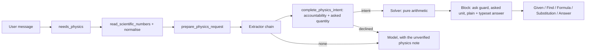

# Recall physics pipeline

Server-side extractors and pure solvers verify physics. The app shows the result; it never
solves physics on-device. A physics answer is either right, with its working, or declined to
the model, unverified. A plausible wrong number is the one outcome the pipeline is built to
prevent.

Code: `apps/api/app/modules/physics/`. Math hands physics over at subject detection
(`services/subject_solving.detect_subject`) and shares no algorithm with it.

## Pipeline

1. **Gate** (`extract.needs_physics`). The gate fires on a verified template's cues, on
   advanced physics vocabulary, or on a digit-free named-body question ("escape velocity of
   Mars"). Words that are ordinary English count only beside a value of their kind:
   - "battery", "circuit" and "resistance" need an electrical value;
   - "momentum", "collision", "impulse" and "recoil" need a mass, a velocity or a force.

   The gate runs on every chat turn, so it is linear-time, cached per text, and reads only
   the head and tail of a long message (4,000 characters in all, up to 20,000). Every
   module-level physics regex is checked for linear time against adversarial text in
   `test_physics_detection_speed.py`.
2. **Read numbers** (`services/number_text.py`). `2 × 10^-6`, `2x10^-6`, `2·10⁻⁶` and
   `2 \times 10^{-6}` are all one number, folded to `2e-6` before anything scans the text.
   Without that, "2 × 10^-6 C" was a charge of −6 C. `numbers.py` then expands every literal
   to a plain decimal, or refuses a malformed one.
3. **Extract** (`extract.py`, `registry.py`, `extractors/`). An ordered chain of extractors
   (`registry.PHYSICS_EXTRACTORS`) runs; the first to match returns a `PhysicsIntent`. The
   order is load-bearing and commented in place. Each extractor module reads one topic; a
   topic with several named laws keeps them in a table tried in a fixed order
   (`fluid_laws.py`, `thermal_laws.py`, `modern.py`).
   Extraction reads at most 4,000 characters, and the result is cached per text.
   When every extractor declines, the **binder** (`binding.py`) reads the question straight
   into a catalog operation. Its engine is subject-neutral and shared
   (`services/law_binding`: the spec types, the givens scanner, the word windows, `fit`
   and the expression evaluator); physics brings its unit table (`givens.PHYSICS_UNITS`),
   its settings (`binding_values`) and its constants (`expression.PHYSICS_NOTATION`):
   - every stated value fills one input of its dimension. Two inputs of one dimension (u
     and v) are told apart by the word just before the value ("from", "to", "initial",
     "reaches") or just after it ("100 turns on the primary"). Inputs that play the same
     part (two capacitors in series) are filled in the order stated;
   - unstated inputs come from phrases ("from rest" is u = 0, "horizontally" is θ = 0,
     "string" makes a resonance n·v/2L) or settings (g; the mass or radius of the planet the
     question names; the charge or mass of the particle it names; water's c and density
     when water is the only substance named; sea-level pressure). A stated value always
     beats a setting;
   - an input that `needs_words` takes a value only when its words name it: an object's
     density is not the fluid's, a tube's diameter is not its radius, and "at 20 °C" is
     not a temperature change;
   - values listed after "and" share the words before the list ("at 100 kPa and 300 K"),
     and the words after a value stop at the first connector ("300 K is heated to 450 K"
     names 450 K, not 300 K). A rate in rad/s or rpm fills only an angular input, never a
     frequency in Hz;
   - a speed written onto c ("0.8c") is the speed of light, so relativity binds without
     the word "relativistic", and a car at 20 m/s never gets a Lorentz factor;
   - an operation's `excludes` words rule it out: a discharge is not a charging;
   - the filled inputs must be exactly a set the operation's solver answers from.

   Anything short of one operation with one way to fill it declines. That includes a value
   no input takes, two values for one input with no word to tell them apart, a value the
   words mark as the asked result ("reaches 18 m/s" when the speed is asked), and an asked
   word that labels a value of another kind ("my weight is 70 kg"). A binding fit is also a
   physics cue for the gate.
4. **Complete** (`request.complete_physics_intent`). Every intent passes two checks before it
   is solved:
   - **Numeric accountability** (`accounting.py`). `givens.scan_givens` lists every stated number with
     its unit and dimension. A solve is refused when it leaves a stated value unbound whose
     dimension it uses — "a KE at 3 m/s and at 4 m/s" binds one speed and would answer half
     the question. A value of another kind is a distractor and stays allowed (a ball's mass
     in free fall). So are values the extractor derived by adding or subtracting givens
     (ΔT = 80 − 20), a direction sign, and a stated g.
   - **Asked quantity** (`ask.py`). The question's ask is read independently of the
     extractor, as dimensions, and kept on `PhysicsIntent.asked`. So is the unit the answer
     is wanted in ("in kWh"), kept on `asked_unit`.
5. **Solve** (`solver.py`, `solvers/`, one module per topic). Pure arithmetic in SI, through
   Pint (`_params_in_si`). Quadratics use the cancellation-free closed form; there is no SymPy on
   the request path.

   Incline extraction retains equilibrium and kinetic motion direction. Static friction
   is the force needed for equilibrium, bounded by `mu_s*N`; it is not automatically that
   maximum. For an already sliding block, downhill-positive acceleration may be negative,
   and uphill motion reverses the friction direction. Without the moving body's initial
   speed the solver emits a force diagram rather than inventing a path from rest.

   SUVAT retains distance versus displacement. A reversal's travelled distance sums both
   portions of the path; a displacement remains signed. Its distance graph is cumulative
   and cannot decrease. Inconsistent givens and a negative elapsed time decline.
6. **Block** (`block.py`). The block refuses a result unless every asked dimension is among
   the results: a time is never the answer to "what is its speed". It converts results to
   the asked unit, then writes two spellings of the answer:
   - `canonical_answer`: plain text with real symbols (`3.97 × 10⁻¹⁹ J (2.48 eV)`), for
     guards and for readers without math.
   - `display_answer`: LaTeX with upright units (`3.97 \times 10^{-19}\,\mathrm{J}`), for
     the answer card.
7. **Respond** (`direct.py`). A complete verified request returns Given / Find / Formula /
   Substitution / Answer without waiting for the model. A given not in SI is followed by the
   value the substitution uses (`λ = 500 nm`, then `λ = 5 × 10⁻⁷ m`). A solver that works
   in the written units (150 km in 2 h) gets no conversion row. Image questions stay on the
   model path.
8. **Finalize** (`fence.py`). The model's answer and visual fences are dropped, and the
   solver's are appended.

## Adding a law

A law the binder can read needs one catalog entry (`catalog/`) and no extractor. The
catalog is also the one list of operations: every `PhysicsIntent` is checked against it
(`catalog.check_intent`) when it is built.
- `variables`, with `words`, `implied` phrases or a `fallback` where the question may name a
  value without a number;
- a `Binding`: the phrases that ask for the result, the result's unit, every set of inputs
  the solver answers from, and cue words when the numbers alone cannot show the situation
  ("horizontally", "pulley");
- for a law that is plain arithmetic, an `expression` (`"(F - mu*m*g)/m"`), with a variant
  per other input set. `services/law_binding/expression.py` evaluates it by walking a checked tree, and prints
  the rearranged formula and the substitution from that same tree. Nothing is executed,
  and nothing calls SymPy.

`test_physics_binding.py` solves every promised input set with sample values and checks the
result units the binding promised, so a binding cannot promise what its solver refuses.

An expression's answer is in SI unless every given of the result's kind shares one unit:
4 µF and 6 µF in series are 2.4 µF, and a 40 cm radius of curvature gives a 20 cm focal
length. Temperatures in °C give a temperature in °C (two waters mixed at 80 °C and 20 °C
reach 44 °C), and a change of temperature stays a change: a rise of 50 °C is 50 K, never
323 K. A question's units also carry over by context (`answer_checks._in_context_units`).
A gas stated in litres or atmospheres, a chemistry class's units, gives a volume in L and a
pressure in atm. A rate from times that share one unit is per that unit: a 5-day half-life
gives 0.139 1/day. The conversion is the last substitution row, as for an asked unit ("in
kWh"). A number written onto an element is an isotope's label, not a given ("carbon-14"). A law whose inputs are roles rather than kinds stays an extractor: Doppler
(`extractors/doppler.py`) reads who moves, toward whom, and a stated speed of sound.

## Coverage

### Explicit symbolic models

Requests beginning with `Physics:` have a separate, whole-request grammar in
`modules/physics/symbolic/`. They run SymPy in the existing bounded worker, without
passing through heuristic numeric extraction. A malformed or unsupported model declines
as a whole. No Python code, attributes, imports, or model-authored expressions are executed.

Supported operations and examples:

| Operation | Example |
|---|---|
| Algebraic rearrangement | `Physics: solve a=F/m for a` (the stated denominator excludes zero mass) |
| Algebraic systems | `Physics: solve F=m*a; F=12; m=3 for F,m,a` |
| Simplification | `Physics: simplify sin(theta)^2+cos(theta)^2` |
| Time or spatial derivatives | `Physics: differentiate A*cos(omega*t) with respect to t` |
| Antiderivatives | `Physics: integrate 2*t with respect to t` |
| Definite integrals | `Physics: integrate k*x with respect to x from 0 to L` |
| Linear first/second-order ODEs | `Physics: ode x''+4*x=0 for x(t)` |
| Cartesian gradient/Laplacian | `Physics: gradient x^2+y^2+z^2 in x,y,z` |
| Cartesian divergence/curl | `Physics: curl [-y,x,0] in x,y,z` |
| Vector dot/cross products | `Physics: cross [1,0,0]; [0,1,0]` |
| Numeric eigenvalues/eigenspaces | `Physics: eigenvectors [[2,0],[0,3]]` |

Algebra returns explicit branches, checks substitution into every original equation,
and retains denominator conditions even when an expression cancels. Systems have up to
four equations/targets and polynomial degree at most four. Unconstrained parameterized
algebra is limited to affine equations with fixed coefficients; coefficient-dependent
rank/degree and nonlinear parameter branches decline rather than publishing a generic
root set as complete. Explicit input denominators keep their nonzero conditions.
General ODE solutions are
checked by `checkodesol`, with nonzero leading coefficients, generic discriminant
conditions for parameterized constant coefficients, and solution-generated singularities
stated explicitly. Exceptional parameter branches and parameterized variable coefficients
decline; nonlinear ODEs are outside this contract. Indefinite integrals are checked by differentiation and retain
an integration constant. Eigenvectors are checked against the matrix. Matrices are square,
of order two through four, with numeric entries; parameterized eigensystem branches decline.
Decimal source tokens are parsed exactly, including scientific notation with exponent
magnitude at most 100. Each expression is capped at 512 characters and 160 AST nodes;
the whole request is capped at 2,000 characters. Output and solve runtime are also bounded.

This verifies a **calculation on the stated model**, not the model's physical validity.
Symbols have no inferred dimensions, sign, reality, or particle identity. Complex solutions
remain explicit. Unit-bearing word problems continue to use the catalog/Pint pipeline.
An unevaluated integral, unresolved derivative, unsupported request, or timed-out solve
stays unverified. The symbolic path does not invent a scene from an arbitrary equation.

The detailed coverage audit and outstanding advanced capabilities are recorded in
[PHYSICS_REVIEW.md](./PHYSICS_REVIEW.md).

### Backend solver coverage

The binder reads these laws, beside the extractors' own:

| Area | Laws |
|------|------|
| Motion | SUVAT for v, s, t, a and u, including s = vt − ½at²; d = vt in any units; fall height; horizontal launch; rocket Δv |
| Forces and energy | W = mg on a named body; Atwood; applied force with friction; static-friction sliding threshold on an incline; P = mgh/t; energy-conservation speed; Kepler period; rotational KE; θ = (ω₀+ω)t/2 |
| Circuits | Q = It for I; Q = CV for Q, C and V; R = ρL/A; τ = RC; RC charging and discharging; capacitors in series and parallel; ideal transformer |
| Fields | E = V/d between plates; F = qE; W = qV (eV with "in eV"); solenoid B = μ₀NI/L; loop center and toroid B; solenoid self-inductance; cyclotron frequency; Hall voltage; electric and magnetic energy densities; magnetic moment μ = IA and τ = μB sinθ when the angle is stated |
| Waves and optics | resonance of a string or pipe; Snell for θ₂; diffraction grating angle; lens power; lenses in contact; lens-maker focal length; telescope angular magnification; compound-microscope magnification when the tube length and near point are stated; Rayleigh criterion; mirror f = R/2; magnification m = −v/u; electromagnetic-wave intensity |
| Thermal | PV = nRT for any unknown; Boyle, Charles, Gay-Lussac and the combined law; Q = mcΔT for any unknown; water mixtures; latent heat; linear, area and volume expansion; isothermal work; mean free path; v_rms, mean and most probable speed; ⟨E_k⟩ = 3/2 kT; diatomic U = 5/2 nRT |
| Fluids | absolute pressure; apparent weight when submerged; floating fraction; capillary rise |
| Modern | photon momentum; threshold frequency and wavelength; stopping potential; photoelectric KE; fraction and mass remaining; decay constant; activity; mean life |
| Upper level | hydrogen transitions (λ and ΔE); Bohr radius; quantum-oscillator levels; relativistic p, E and K; E² = (pc)² + (mc²)²; velocity addition; Schwarzschild radius; Boltzmann ratio; S = k ln Ω; energy-time uncertainty; an orbit's period from its height |
| One formula | physical and conical pendulum periods; torsional pendulum; thin rod about its center or one end; springs in series and in parallel; reduced mass; coefficient of restitution; gravitational fractional frequency shift; decay time from N₀ to N; speed to just complete a vertical loop; sound level; shear, bulk and Poisson; gear speed and gear ratio; Newton's law of cooling; absorbed or reflected radiation pressure; Otto efficiency |

## Numbers and units

- **Answers** have three significant figures, trailing zeros trimmed. Scientific notation is
  used outside [10⁻³, 10⁵), and rounding comes first: 99999.7 is 1 × 10⁵. One formatter does
  this, `display.py`; a solver never picks its own format.
- **Givens** are echoed with the figures the user typed, up to six. A given is never rounded
  to answer precision.
- **Units** are upright, with their symbols: m/s², kg·m², J/(kg·K), Ω, °. In LaTeX the unit
  is a `\mathrm{…}` run holding that plain spelling, because MathText draws a `\mathrm` group
  as written.
- **Working rows** never show calculator notation: `6.6261e-34` is typeset as
  `6.6261 \times 10^{-34}`.
- **Scene labels** are formatted from the true values. Re-rounding a label that a solver had
  already rounded put 59.0 N on the picture beside a 59.1 N answer.
- **Scene coordinates** retain their floating-point precision instead of rounding to fixed
  SI decimal places. Micrometre orbits keep their shape. Vertical launches receive padded
  horizontal bounds, and static scene bounds include vector anchors and endpoints in all
  quadrants. Height diagrams place the body above the ground by the stated height.

## Clients

`docs/fixtures/physics_replies.json` holds real direct replies and the plain answer each
carries. Three tests read the file:
- `test_physics_reply_contract.py` proves the server still writes those replies. Regenerate
  with `UPDATE_PHYSICS_FIXTURE=1` to accept an intended change.
- The web test (`physicsReplyContract.test.ts`) proves the answer card reads as the plain
  answer on a page with no math renderer (`answerNotation.readableLatexAnswer`).
- The mobile test (`physicsReplyContract.test.ts`) proves copy and read-aloud carry the
  answer, and that `30^\circ` reads as thirty degrees.

## Scanner

A photographed problem goes through the same pipeline as a typed one.

1. The camera's physics tab sends the crop to `POST /physics/scan/read` (`api.py`). The shared
   guard in `services/scan_read.py` checks the payload, the vision spend cap and the per-user
   rate, as it does for math and chemistry.
2. `read.py` asks `vision-chat` for the problem as written, then turns any LaTeX into the text
   a student would type: `2 \times 10^{-6}\,\mathrm{C}` becomes `2 × 10^-6 C`, `30^{\circ}`
   becomes `30°`, and `\mu` is µ before a unit and μ elsewhere.
3. The student checks the reading under **I read this as**, then chooses:
   - **Solve** sends the text alone, so it gets the verified Given / Find / Formula /
     Substitution / Answer reply of a typed question;
   - **Send photo** sends the crop with `I read this as: …`. The turn verifies that reading
     (`subject_solving._physics_request_text`), and the model writes the reply, since the
     photo may hold a diagram the text does not.

A physics caption is physics, never math: math neither OCRs the photo nor claims the
confirmed reading. A photo with no reading gets the unverified physics note.

## Quality bar

`app/tests/modules/physics/corpus.py` holds school questions with hand-worked answers
(g = 9.81 m/s², CODATA constants), must-decline traps, and non-physics negatives.
`test_physics_corpus.py` asserts three things:
- a verified answer always matches its expected value;
- traps decline and negatives are not physics;
- coverage never falls below `COVERAGE_FLOOR`.

## What it refuses

A refusal is a decline to the model, labelled unverified, never a guessed number. The
pipeline refuses:
- a question longer than 4,000 characters (it still gets the physics note);
- a number it cannot read whole;
- a stated value of a kind the solve uses, left unbound;
- a result whose kind is not the asked one, and a price ("find the cost"), which no law
  answers;
- a Doppler speed with no direction, or one speed when both parties move;
- a magnification from a virtual image's distance, or a convex mirror's focal length, whose
  sign the conventions disagree on;
- values listed "respectively" for inputs told apart by words ("primary and secondary coils
  with 100 and 500 turns respectively"); a list the law fills in order still binds;
- every refusal listed under Physics in `FEATURES.md` (an unstated collision type, a
  diverging lens, an absolute temperature written as bare "degrees", and the rest).
