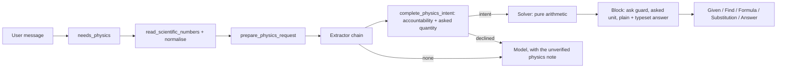

# Recall physics pipeline

Server-side extractors and pure solvers verify physics. The app shows the result; it never
solves physics on-device. A physics answer is either right, with its working, or declined to
the model, unverified. A plausible wrong number is the one outcome the pipeline is built to
prevent.

Code: `apps/api/app/modules/physics/`. Math hands physics over at subject detection
(`services/subject_solving.detect_subject`) and shares no algorithm with it.

## Pipeline

1. **Gate** (`extract.needs_physics`). The gate fires on a verified template's cues, on
   advanced physics vocabulary, or on a digit-free named-body question ("escape velocity of
   Mars"). Words that are ordinary English count only beside a value of their kind:
   - "battery", "circuit" and "resistance" need an electrical value;
   - "momentum", "collision", "impulse" and "recoil" need a mass, a velocity or a force.

   The gate runs on every chat turn, so it is linear-time, cached per text, and reads only
   the head and tail of a long message (4,000 characters in all, up to 20,000). Every
   module-level physics regex is checked for linear time against adversarial text in
   `test_physics_detection_speed.py`.
2. **Read numbers** (`services/number_text.py`). `2 × 10^-6`, `2x10^-6`, `2·10⁻⁶` and
   `2 \times 10^{-6}` are all one number, folded to `2e-6` before anything scans the text.
   Without that, "2 × 10^-6 C" was a charge of −6 C. `numbers.py` then expands every literal
   to a plain decimal, or refuses a malformed one.
3. **Extract** (`extract.py`, `extractors/`). An ordered chain of extractors runs; the first
   to match returns a `PhysicsIntent`. The order is load-bearing and commented in place.
   Extraction reads at most 4,000 characters, and the result is cached per text.
4. **Complete** (`request.complete_physics_intent`). Every intent passes two checks before it
   is solved:
   - **Numeric accountability** (`accounting.py`). `givens.py` lists every stated number with
     its unit and dimension. A solve is refused when it leaves a stated value unbound whose
     dimension it uses — "a KE at 3 m/s and at 4 m/s" binds one speed and would answer half
     the question. A value of another kind is a distractor and stays allowed (a ball's mass
     in free fall). So are values the extractor derived by adding or subtracting givens
     (ΔT = 80 − 20), a direction sign, and a stated g.
   - **Asked quantity** (`ask.py`). The question's ask is read independently of the
     extractor, as dimensions, and kept on `PhysicsIntent.asked`. So is the unit the answer
     is wanted in ("in kWh"), kept on `asked_unit`.
5. **Solve** (`solver.py`, `solvers/`). Pure arithmetic in SI, through Pint
   (`_params_in_si`). Quadratics use the cancellation-free closed form; there is no SymPy on
   the request path.
6. **Block** (`block.py`). The block refuses a result unless every asked dimension is among
   the results: a time is never the answer to "what is its speed". It converts results to
   the asked unit, then writes two spellings of the answer:
   - `canonical_answer`: plain text with real symbols (`3.97 × 10⁻¹⁹ J (2.48 eV)`), for
     guards and for readers without math.
   - `display_answer`: LaTeX with upright units (`3.97 \times 10^{-19}\,\mathrm{J}`), for
     the answer card.
7. **Respond** (`direct.py`). A complete verified request returns Given / Find / Formula /
   Substitution / Answer without waiting for the model. A given not in SI is followed by the
   value the substitution uses (`λ = 500 nm`, then `λ = 5 × 10⁻⁷ m`). A solver that works
   in the written units (150 km in 2 h) gets no conversion row. Image questions stay on the
   model path.
8. **Finalize** (`fence.py`). The model's answer and visual fences are dropped, and the
   solver's are appended.

## Numbers and units

- **Answers** have three significant figures, trailing zeros trimmed. Scientific notation is
  used outside [10⁻³, 10⁵), and rounding comes first: 99999.7 is 1 × 10⁵. One formatter does
  this, `display.py`; a solver never picks its own format.
- **Givens** are echoed with the figures the user typed, up to six. A given is never rounded
  to answer precision.
- **Units** are upright, with their symbols: m/s², kg·m², J/(kg·K), Ω, °. In LaTeX the unit
  is a `\mathrm{…}` run holding that plain spelling, because MathText draws a `\mathrm` group
  as written.
- **Working rows** never show calculator notation: `6.6261e-34` is typeset as
  `6.6261 \times 10^{-34}`.
- **Scene labels** are formatted from the true values. Re-rounding a label that a solver had
  already rounded put 59.0 N on the picture beside a 59.1 N answer.

## Clients

`docs/fixtures/physics_replies.json` holds real direct replies and the plain answer each
carries. Three tests read the file:
- `test_physics_reply_contract.py` proves the server still writes those replies. Regenerate
  with `UPDATE_PHYSICS_FIXTURE=1` to accept an intended change.
- The web test (`physicsReplyContract.test.ts`) proves the answer card reads as the plain
  answer on a page with no math renderer (`answerNotation.readableLatexAnswer`).
- The mobile test (`physicsReplyContract.test.ts`) proves copy and read-aloud carry the
  answer, and that `30^\circ` reads as thirty degrees.

## Quality bar

`app/tests/modules/physics/corpus.py` holds school questions with hand-worked answers
(g = 9.81 m/s², CODATA constants), must-decline traps, and non-physics negatives.
`test_physics_corpus.py` asserts three things:
- a verified answer always matches its expected value;
- traps decline and negatives are not physics;
- coverage never falls below `COVERAGE_FLOOR`.

## What it refuses

A refusal is a decline to the model, labelled unverified, never a guessed number. The
pipeline refuses:
- a question longer than 4,000 characters (it still gets the physics note);
- a number it cannot read whole;
- a stated value of a kind the solve uses, left unbound;
- a result whose kind is not the asked one;
- every refusal listed under Physics in `FEATURES.md` (an unstated collision type, a
  diverging lens, an absolute temperature written as bare "degrees", and the rest).
